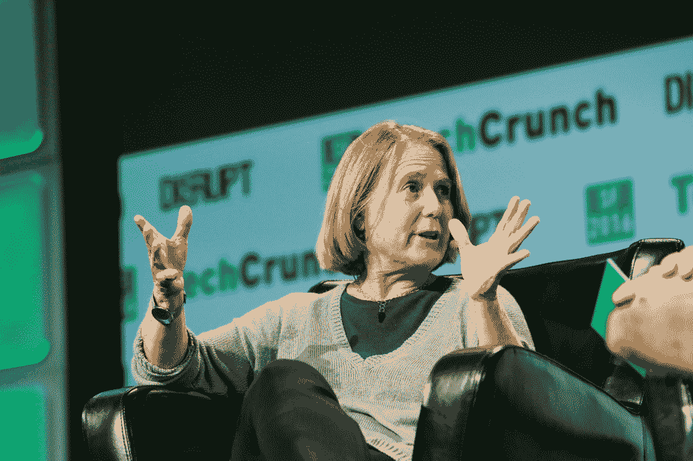
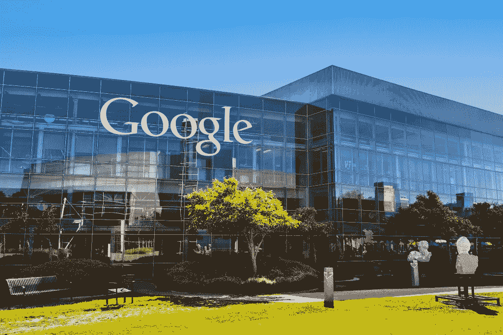

# 云中的谷歌 

> 原文：<https://web.archive.org/web/https://techcrunch.com/2017/03/09/google-in-the-cloud/>

对于谷歌云平台来说，这是关键的一周。

在旧金山举办年度[Google Cloud Next Conference](https://web.archive.org/web/20221209002442/https://beta.techcrunch.com/tag/google-next-2017/)之际，它将提供人们在此类活动中预期的常见演讲者阵容、客户评价和产品发布，但更广泛、更具挑战性的任务是向世界展示它已准备好迎接企业。

为此，谷歌在过去的 18 个月里一直在努力将自己定位为云市场领导者 AWS T5(在某种程度上，微软和 IBM 也在争夺相同的企业客户)的[的更开放的替代者。他们相信，如果他们能够利用他们多年来建立的云智能，混合各种开源项目，并将他们内部创建的一些工具产品化，以管理他们自己的大规模云，他们可以为自己开拓出一个巨大的市场。](https://web.archive.org/web/20221209002442/https://beta.techcrunch.com/2017/02/13/why-aws-has-such-a-big-lead-in-the-cloud/)

谷歌未来面临的挑战仍然是说服企业客户，在这么长时间没有关注他们之后，它认真对待他们的需求。这将需要一次一个客户地建立一个案例，就像一家初创公司试图在一个成熟的市场中杀出一条血路一样，对于谷歌这样的巨头来说，这肯定是一个奇怪的位置。

## 把我传送上去，史考特

当 Alphabet [在 2015 年 11 月](https://web.archive.org/web/20221209002442/https://beta.techcrunch.com/2015/11/19/google-buys-bebop-and-names-diane-greene-to-lead-enterprise-cloud-effort/)聘请黛安格林(Diane Green)管理其谷歌云部门时，它表明该公司已经准备好争夺企业云市场的一块。多年来一直担任 VMWare 联合创始人兼首席执行官的格林赋予了该公司以前所缺乏的企业血统。

谷歌公共云基础设施故事中令人困惑的部分是它花了多长时间才开始。毕竟，这不是微软或 IBM 在保护其内部计算业务。谷歌诞生于云端，是 Gmail 等云服务的最早提供者之一。然而，尽管 AWS 在 2006 年推出了第一个公共云基础设施服务，但谷歌花了几年时间才赶上，又花了几年时间才雇佣了格林，AWS 首席执行官安迪·杰西在最近的一次采访中承认[这让 AWS 的人感到困惑。他们做梦也没想到自己会领先六七年。](https://web.archive.org/web/20221209002442/https://beta.techcrunch.com/2017/02/13/why-aws-has-such-a-big-lead-in-the-cloud/)

对谷歌来说，好消息是，尽管基础设施即服务已经存在了十多年，但在许多方面它仍然是一个新兴市场，格林在上个月的高盛会议上很高兴地提出了这一点。当被问及如果这是一场棒球比赛，我们在云市场演变中处于什么位置时，她开玩笑说我们还在听国歌。对于格林来说，这可能有点夸张的一厢情愿，但进一步贯彻采访者的比喻，这显然还为时过早。

谷歌云平台负责人黛安·格林

## 非常不合逻辑

追踪云市场份额的公司 Synergy Research 的分析师 John Dinsdale 说，也许谷歌面临的最大障碍是试图让企业客户相信它对他们是认真的。“当然，问题在于它上市较晚，以及人们认为谷歌在企业中不够强大。直到最近，谷歌从未给人留下云服务对它真的很重要的印象(通过言语或行为)。它现在正试图弥补失地，但 AWS 和微软遥遥领先，”他解释道。

> 当 Kubernetes 开始时，这是一种不自然的行为。谷歌没有为开源社区做出贡献，但是一群人认为他们需要改变云中的游戏，开源是实现这一目标的方法。

—斯科特·雷尼，红点

但是谷歌已经在利用开源引领潮流方面取得了一些进展。以流行的开源容器编排系统 Kubernetes 为例，风险投资公司 Redpoint 的合伙人 Scott Raney 表示，这表明谷歌可以提供强大的开源工具，这让这个市场的一些人感到惊讶。

“当 Kubernetes 开始时，这是一种不自然的行为。雷尼说:“谷歌没有为开源社区做出贡献，但一群人在内部认为他们需要改变云中的游戏，开源是实现这一目标的途径。

Kubernetes，实际上是所有由谷歌产生的[开源项目](https://web.archive.org/web/20221209002442/https://developers.google.com/open-source/projects)，例如用于机器学习的 TensorFlow、用于启动大规模分布式数据库的 Spanner 或用于 3D 图形压缩的 Draco，仅举几个例子，都是为了成为一个更加开放的组织而在内部进行的协调一致的努力的一部分。

## 反抗是徒劳的

这种开放性正是[吸引 GCP 产品管理副总裁萨姆·拉姆奇去年 11 月](https://web.archive.org/web/20221209002442/https://beta.techcrunch.com/2016/11/17/cloud-foundry-foundation-ceo-sam-ramji-departs-for-google/)从 Cloud Foundry 加入谷歌的原因。拉姆奇承认他不是在找工作，但他惊喜地发现了这样一个开放的理念，他看到了将谷歌云塑造成一个开发者友好平台的机会——他说，这个机会太好了，不能错过。

照片:罗恩·米勒

“我的工作是让[开放哲学]发生，并使之成为现实，”拉姆奇解释道。他说，当他去年与谷歌云平台副总裁布莱恩·史蒂文斯谈论接受这份工作时，他没有考虑过谷歌是一个从事开放事物的地方。当他被告知愿景是让 GCP 成为开放的云时，“我觉得真的很震惊，”他说。

这种开放理念现在涵盖了所有领域，包括让客户在谷歌的基础设施上运行他们选择的任何开源堆栈，发布和支持开源项目，并使生态系统，即在 GCP 基础上构建工具和技术的合作伙伴，成为该平台的一等公民。拉姆奇说:“我们将他们视为整体的一部分，网络带来了你想要的技术，并使用谷歌技术或任何(合作伙伴)服务。”。

例如，它的开源海报孩子 Kubernetes 可以在任何平台上运行。就在最近[微软发布了 Azure 上的 Kubernetes](https://web.archive.org/web/20221209002442/https://beta.techcrunch.com/2017/02/21/kubernetes-on-microsofts-azure-container-service-is-now-generally-available/)。拉姆奇还兴奋地指出，AWS 上的 TensorFlow 应用比 GCP 还多，这可能比 Azure 上的 Kubernetes 更令人震惊。

## 就这样吧

问题变成了，你如何在拥挤的市场中脱颖而出，红点的雷尼说，赢得开发者的方法是开放。“他们需要赢得开发商的心。显然亚马逊已经做到了。如果你是谷歌，你怎么玩这个游戏？你不能只是推出类似的服务，”他说。

“事实上，这些人越来越支持开源社区，这让人们对谷歌感觉更好，也让开发者对使用他们的工具感觉更好，因为他们可以避免锁定，”他补充道。

产品管理总监 Greg DeMichillie 解释说，事实上，传统技术供应商让企业购买者感到沮丧的最大原因之一是受到束缚。

“我们在脱离(我们的平台)方面的投资与我们在继续发展方面的投资一样多，因为我们真诚地相信开源和开放 API 将是至关重要的。你与之交谈的每家企业都与‘甲骨文’和其他公司签订了合同，它们看起来是不错的交易，但最终它们并不满意——而云是一个不重复这一错误的机会，”他说。

Forrester cloud 分析师 Dave Bartoletti 表示，该公司还可以利用其在数据和分析方面的优势。“如果我有一万亿字节的客户情绪数据，我如何将它放在一个平台上，运行机器学习算法，并获得有用的答案——甚至为合作伙伴开源，让事情继续下去，”他问道。这正是谷歌正在做的事情。

格林在上个月的高盛会议上发言时指出，数据和分析是该公司的特殊优势。当主持人问及通向企业的最简单途径是什么时，她回答说是围绕数据管理和分析。

来源:Turtix/ [Shutterstock](https://web.archive.org/web/20221209002442/http://www.shutterstock.com/pic-192086159/stock-photo-mountain-view-ca-usa-october-exterior-view-of-a-google-headquarters-building-google.html?src=m2mp0h3rKXR9ZW-D76JTDQ-1-2)

## 我把她所有的都给她了，上尉

所有这些都将我们带到了本周的谷歌下一次会议，以及该公司计划推出哪些内容来继续推进这一战略。首先，该公司于周三宣布与 Rackspace(T4)和 SAP(T6)建立合作伙伴关系，这向人们渴望的企业信誉迈出了一步。它展示了像汇丰银行和易贝这样的大客户，并宣布了新的人工智能 API，旨在通过降低与使用人工智能工具相关的复杂性，帮助将这项技术引入企业。这包括[一个识别视频中物体的漂亮工具](https://web.archive.org/web/20221209002442/https://beta.techcrunch.com/2017/03/08/googles-new-machine-learning-api-recognizes-objects-in-videos/)。

它还发布了一个新版本的 App Engine，据说强调了开放性。虽然它仍然是一个托管服务，但它现在允许开发人员使用他们选择的开发语言，这应该会对他们更有吸引力。

拉姆奇说，这意味着对开发者来说没有进入壁垒，他们可以随时离开，这是开放战略的一个关键方面，该公司发言人不断强调。“下一代应用引擎允许你携带任何运行时或库，如果你想离开，你可以得到一个标准的 Docker 容器，”他说。

另一项重大宣布涉及云功能，这是一种无服务器计算工具，提供了一种创建事件驱动的应用程序和微服务的方式，类似于 [AWS Lambda](https://web.archive.org/web/20221209002442/https://beta.techcrunch.com/2015/11/24/aws-lamda-makes-serverless-applications-a-reality/) 和[微软的 Azure Functions](https://web.archive.org/web/20221209002442/https://beta.techcrunch.com/2016/03/31/microsoft-answers-aws-lambdas-event-triggered-serverless-apps-with-azure-functions/) 。这意味着您只需在事件发生时为计算服务付费，而不是一直为服务器付费，即使它并不活跃。

最后，谷歌宣布与移动开发平台 Firebase 整合，通过一个 SDK 直接整合云功能和 Firebase，他们说这是开发人员一直渴望的。*

Forrester 的 Bartoletti 说，挑战仍然是将他们在内部使用的所有这些东西转化为产品，以运行他们自己的云应用程序。“他们必须在 SaaS 应用和运行自己的云之间做得更好，但 Kubernetes 是一个很好的迹象，表明他们正在做正确的事情，”他说。

总的来说，谷歌正试图将自己转变为一家企业友好型公司，开辟出一个最开放、对开发者最友好的利基市场。“这是一个不错的聪明策略。是否足够有待确定，但谷歌不仅仅是走出去玩亚马逊的游戏。红点公司的雷尼说:“它试图改变一点游戏规则。

**请在[我们对下一届](https://web.archive.org/web/20221209002442/https://beta.techcrunch.com/tag/google-next-2017/)谷歌云大会的全面报道中寻找这些公告的更多详细报道。*

###### *布莱斯·德宾的特色图片*

