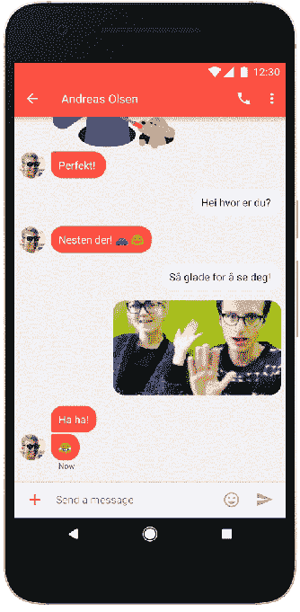

# 谷歌与第三大运营商 Telenor 合作开发 Android RCS 消息服务 

> 原文：<https://web.archive.org/web/https://techcrunch.com/2017/02/16/google-inks-third-carrier-telenor-to-its-android-rcs-messaging-play/>

另一家移动运营商 Telenor 已经与谷歌合作推出下一代短信技术——这次是针对欧洲和亚洲的 Android 用户。

Rich Communications Services(又名 RCS)技术的总体目标是为 SMS 用户带来增强的消息传递体验，实现 iMessage 风格的功能，如群聊、阅读回执和打字指示以及高分辨率照片共享。

谷歌参与的技术风格是将自己的 Messenger 应用程序集成到原生 SMS 应用程序中，以便为新的 Android 手机带来升级的原生消息功能。

去年年底，这种 RCS 技术在美国和加拿大被推广到使用 [Sprint](https://web.archive.org/web/20221025223827/https://beta.techcrunch.com/2016/11/04/google-brings-rcs-the-next-gen-upgrade-to-sms-to-android-phones-on-sprint/) 和 [Rogers](https://web.archive.org/web/20221025223827/https://beta.techcrunch.com/2016/12/13/google-brings-rcs-a-next-gen-upgrade-to-sms-to-rogers-customers-in-canada/) 网络的 Android 硬件上，Sprint 是谷歌在该计划中的第一个运营商合作伙伴。

Telenor 的覆盖范围包括印度和泰国等国家，以及多个欧洲国家，它总共拥有大约 2.14 亿移动用户——因此这是谷歌倡议潜在影响的最大一次。

也就是说，如果该公司希望为其全面升级 Android 用户短信体验的努力建立全面的支持，它还有很长的路要走。

大约一年前，Mountain View [宣布](https://web.archive.org/web/20221025223827/https://beta.techcrunch.com/2016/02/22/after-jibe-mobile-buy-google-to-provide-carriers-with-android-rcs-client/)与移动运营商共同努力推动下一代短信标准，计划在 Android 中包含一个 RCS 消息客户端。

尽管个别运营商也有责任加入进来，为他们的网络提供技术，这突显了谷歌/Alphabet 面临的分裂挑战的规模，因为运营商往往会优先考虑自己的竞争商业利益，而不是与谷歌保持一致。(而苹果封闭的 iOS 生态系统更容易回避这些问题。)

事实上，运营商早在十年前就开始研究 RCS 了，他们的想法是全面改进 SMS。然而，根据移动行业协会 GSMA T1 的数据，目前全球只有大约 50 家运营商推出了 RCS，覆盖 37 个国家，支持 156 种设备。(而且，要明确的是，这些推出的大部分也是 RCS 标准的旧版本——即，不是更新的、谷歌支持的、搭载 Android RCS 消息客户端的版本。)

2015 年，谷歌显然厌倦了作为旁观者等待运营商一起采取集体信息行动——[收购了标准领域的专家 Jibe Mobile](https://web.archive.org/web/20221025223827/https://beta.techcrunch.com/2015/09/30/google-acquires-jibe-mobile-to-help-adopt-new-standard-for-carrier-messaging/) ，用它的话说，“帮助将 RCS 带给全球观众”。或者更确切地说，试图说服运营商与跨网络 Android 到 Android 的下一代短信策略保持一致的好处。

这个目标进展如何？本文列出的三家运营商。尽管该公司表示将在“未来几个月”推出更多的 RCS，并在本月晚些时候举行的移动世界大会贸易展上宣布相关消息，因此预计更多的运营商将很快加入这一行列。

无论哪种方式，谷歌距离其追求的目标——让 iMessage 的全面竞争对手融入 Android 用户的即时消息体验——仍有很长的路要走。Android 生态系统的多样性使得任何推动增强的原生消息功能标准化的努力都是徒劳的。

即使运营商同意推出其 RCS 风格，如 Telenor 现在所做的那样，该计划也依赖于其网络的现有用户已经在手机上安装了谷歌信使应用程序，以便自动获得更新(通过该应用程序的更新)。或者以后安装信使应用程序。

谷歌今天表示，作为与 Telenor 合作的一部分,“许多”新的 Android 设备将预装 Messenger for Android 作为默认的 SMS 和 RCS 消息应用程序。但是很多=/=全部。因此，它的 RCS 功能也受到兼容设备有限的限制。

可以肯定地说，如果 Android 要登上“更好的原生消息”这座大山，许多玩家将需要长期参与其中。

与此同时，像脸书旗下的 WhatsApp 这样的顶级移动通讯应用巨头——其功能丰富的通讯平台拥有超过 10 亿的月活跃用户——继续蚕食短信业务，从本地通讯客户端拉走用户。这意味着无论如何，所有这些努力最终都可能“太少、太迟”。