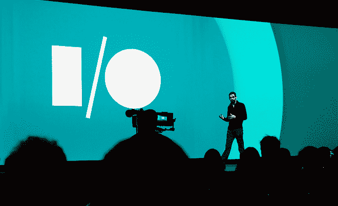

# 谷歌 I/O 2015 定于 5 月 28 日至 29 日举行，门票将再次以抽奖方式出售 

> 原文：<https://web.archive.org/web/https://techcrunch.com/2015/02/10/google-io-2015-set-for-may-28-29-tickets-to-be-sold-lottery-style-again/>

# 谷歌 I/O 2015 定于 5 月 28 日至 29 日，门票将再次以抽奖的方式出售

去年，谷歌引入了参加年度 I/O 大会的新要求:一点运气。考虑到对门票的巨大需求，与会者必须在抽奖中随机挑选，才有机会为*购买*一张门票。

不管你喜不喜欢，这个系统今年又回来了。

**谷歌刚刚公布了 2015 年谷歌 I/0 的首批细节:**

*   会议本身将于 5 月 28 日至 29 日举行。一如既往，它将在旧金山莫斯康中心西举行。
*   门票注册将于太平洋时间 3 月 17 日上午 9 点开始，持续两天。不过，不必急着早到，因为…
*   谷歌将随机挑选“有机会购买一张票”的人。

这些门票往往会很快被抢购一空，如果只是因为谷歌传统上向所有与会者赠送的礼物往往远远超过入场费。例如，去年谷歌给了每个人不止一个，而是*两个* Android Wear 智能手表(当然还有[谷歌 Cardboard](https://web.archive.org/web/20221127165219/https://beta.techcrunch.com/2014/06/25/hands-on-with-googles-incredibly-clever-cardboard-virtual-reality-headset/) )。

今年的票价还没有消息；去年的门票是 900 美元。