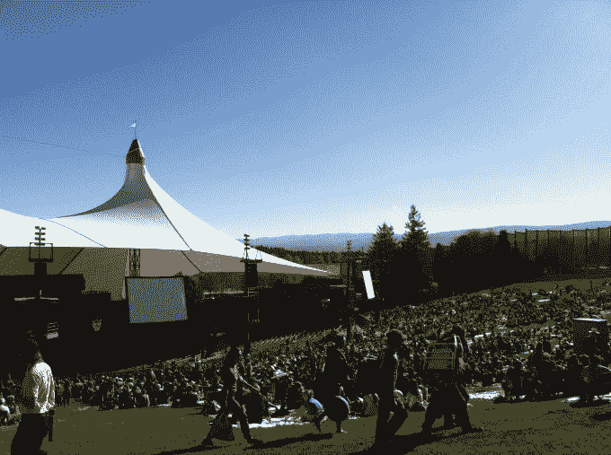

# 谷歌 I/O 将于 5 月 18 日至 20 日在海岸露天剧场举行

> 原文：<https://web.archive.org/web/https://techcrunch.com/2016/01/12/google-io-hitting-mountain-view-on-may-18th-20th-at-shoreline-amphitheatre/>

# 谷歌 I/O 将于 5 月 18 日至 20 日在海岸圆形剧场登陆山景城

我们还没有太多的细节，但谷歌首席执行官桑德尔·皮帅刚刚让世界知道谷歌 I/O 将在今年何时何地举行。

https://plus.google.com/+SundarPichai/posts/Gi7EcHRTrNc

会议通常在旧金山的 Moscone 中心举行，但似乎该公司希望让会议离他们更近，并且在户外举行。

毫无疑问，该公司将像每年一样展示新的硬件和软件，但这将是其字母表霸主和皮查伊掌舵下的第一次活动。

为什么要在户外召开开发者大会？嗯，也许我们会看到谷歌之翼的行动，或者一些无人机，或者 Loon…或者你知道，自动驾驶汽车。也许是戴夫·马修斯乐队？一个男孩可以梦想。

海岸线圆形剧场可以容纳 22，500 人，有趣的是，它在谷歌上被标记为“永久关闭”。