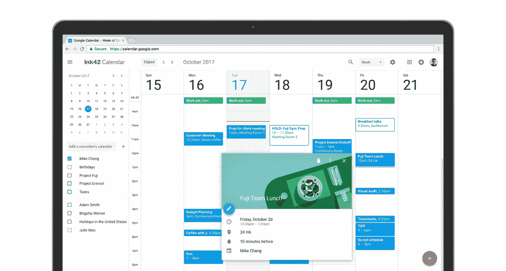

# 谷歌将强迫你使用它的新日历设计 

> 原文：<https://web.archive.org/web/https://techcrunch.com/2018/01/03/google-is-about-to-force-you-to-use-its-new-calendar-design/>

# 谷歌将强迫你使用它的新日历设计

去年 10 月，谷歌[宣布](https://web.archive.org/web/20221210001241/https://beta.techcrunch.com/2017/10/17/google-calendar-on-the-web-gets-a-fresh-new-look/)重新设计了桌面谷歌日历的外观和感觉。不是每个人都喜欢这个设计(包括我，尽管[有些人](https://web.archive.org/web/20221210001241/https://twitter.com/mjburnsy?lang=en)告诉我我错了)，但是很快你的意见就不重要了，因为谷歌将会把你的日历升级到新的设计。

正如[公司今天](https://web.archive.org/web/20221210001241/https://gsuiteupdates.googleblog.com/2018/01/new-google-calendar-web-ui-to-begin.html)宣布的，其管理员[选择](https://web.archive.org/web/20221210001241/https://support.google.com/a/answer/172177?hl=en)进入快速发布计划的 G Suite 用户将从 1 月 8 日开始自动升级，而那些进入计划发布计划的用户将从 1 月 15 日开始升级。在 2 月 28 日之前，你仍然可以选择退出新的用户界面，但在那之后，“所有用户都将得到全面升级。”

值得注意的是，新设计只是刷新日历的一个方面。它还包括使会议室预订更容易的新功能，并允许您对日历邀请应用丰富的格式。

就我个人而言，我仍然回到了旧的设计，因为我更喜欢更紧凑的视图，但正如我上面所说的，很有可能我错了。欢迎在评论里告诉我我是对的。 