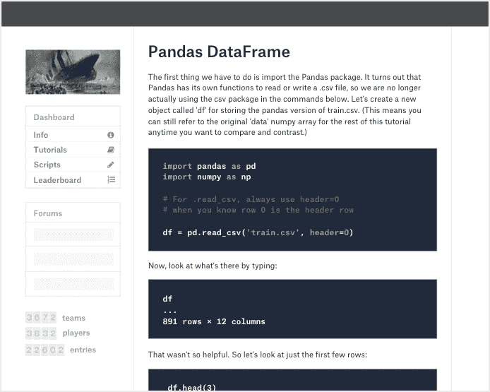

# 谷歌正在收购数据科学社区 Kaggle 

> 原文：<https://web.archive.org/web/https://techcrunch.com/2017/03/07/google-is-acquiring-data-science-community-kaggle/>

消息人士告诉我们，谷歌正在收购 [Kaggle](https://web.archive.org/web/20230403213624/https://www.kaggle.com/) ，这是一个举办数据科学和机器学习[竞赛](https://web.archive.org/web/20230403213624/https://www.kaggle.com/competitions)的平台。这笔交易的细节仍有些模糊，但鉴于谷歌本周将在旧金山举办其云下一次会议，官方声明最早可能于明天发布。

在接受电话采访时，Kaggle 联合创始人兼首席执行官安东尼·戈德布卢姆(Anthony Goldbloom)拒绝否认收购正在进行。谷歌本身拒绝“对传言置评”。

Kaggle 的平台上有大约 50 万数据科学家，由 Goldbloom 和 Ben Hamner 在 2010 年创立。这项服务起步较早，尽管它有一些竞争对手，如 DrivenData、TopCoder 和 HackerRank，但它通过专注于特定的利基市场，成功地保持了遥遥领先。这项服务基本上是运行数据科学和机器学习竞赛的事实上的家。

通过 Kaggle，谷歌购买了一个最大、最活跃的数据科学家社区——凭借这一点，它也将在这个社区中获得更多的关注(尽管由于 Tensorflow 和其他项目，它已经有了很多)。

Kaggle 与谷歌也有一段历史，但那是最近的事了。本月早些时候，谷歌和 Kaggle 合作举办了一场价值 10 万美元的机器学习比赛，围绕着对 YouTube 视频进行分类的[。这场竞争也与谷歌云平台有一些深度整合。](https://web.archive.org/web/20230403213624/https://www.kaggle.com/)

我们的理解是，谷歌将保持这项服务的运行——很可能以现在的名字。

虽然这次收购可能更多的是关于 Kaggle 的社区而不是技术，但 Kaggle 确实为其竞争对手和“内核”开发了一些有趣的工具。在 Kaggle 上，[内核](https://web.archive.org/web/20230403213624/https://www.kaggle.com/kernels)基本上是分析数据集的源代码，开发者可以在平台上共享这些代码(之前[的公司称它们为“脚本”](https://web.archive.org/web/20230403213624/http://blog.kaggle.com/2016/07/08/kaggle-kernel-a-new-name-for-scripts/))。

像类似的以竞争为中心的网站一样，Kaggle 也经营着一个招聘平台。目前还不清楚谷歌将如何处理这部分服务。

根据 Crunchbase 的报道，自 2010 年推出以来，Kaggle 已经筹集了 1250 万美元(尽管 PitchBook 说是 12.75 美元)。Kaggle 的投资者包括 Index Ventures、SV Angel、麦克斯·拉夫琴、Naval Ravikant、谷歌首席经济学家哈尔·瓦里安、科斯拉风险投资公司和尤里·米尔纳。

【T2