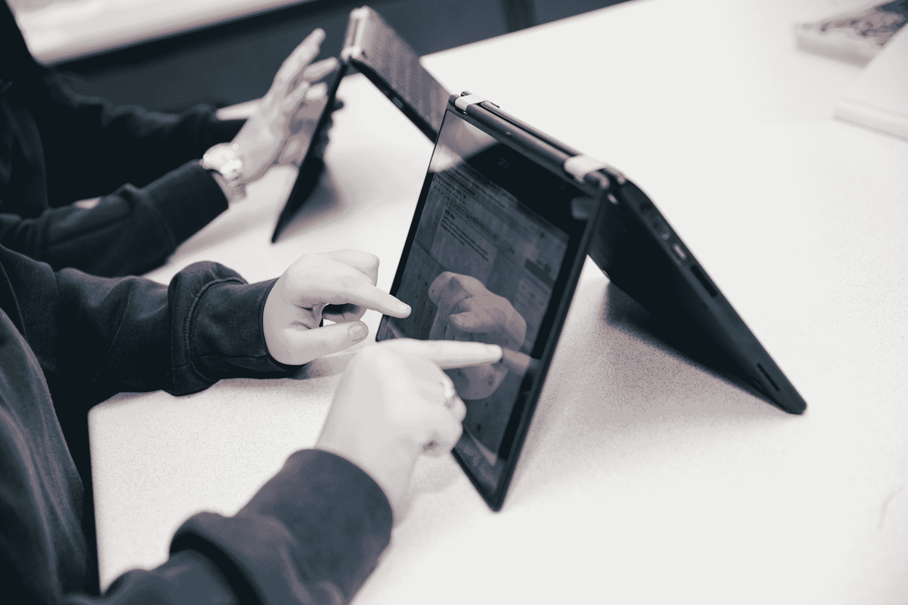
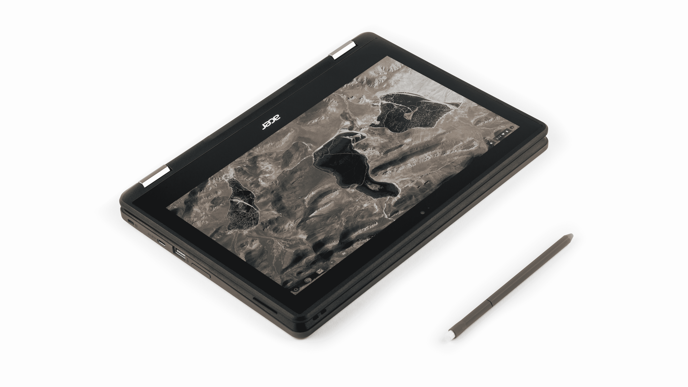

# 谷歌让 Chromebooks 对学校更加有用

> 原文：<https://web.archive.org/web/https://techcrunch.com/2017/01/24/google-is-making-chromebooks-even-more-useful-for-schools/>

今天在伦敦举行的 [Bett](https://web.archive.org/web/20230404110809/http://www.bettshow.com/) 教育技术大会上，谷歌就其 Chromebook 计划发布了多项重大声明。除了透露现在有超过 2000 万名教师和学生每周至少使用 Chromebook，以及现在有超过 7000 万名 G Suite 用于教育用户，该公司还展示了两款新的可转换 Chromebook，支持触控笔，USB-C 充电和面向世界的摄像头，华硕 Chromebook C213 和宏碁 Chromebook Spin 11。

此外，谷歌今天宣布，它将很快让管理员完全控制他们给学生的 chrome book 上运行的 Android 应用程序，Adobe 正在推出一套新的 Android 创意应用程序，这些应用程序现已针对 chrome book 进行了优化。

这方面的趋势显而易见:Chromebooks 和 G Suite for Education 显然是谷歌的巨大成功，该公司正在与其硬件合作伙伴合作，使它们对学校更具吸引力。谷歌 Android 和 Chrome 教育和企业产品管理总监 Rajen Sheth 在今天宣布之前的新闻发布会上指出，公司关注教师的反馈。it 部门不断收到的一个请求是，教师们正在寻找一种单一、坚固的设备，它结合了平板电脑和带全键盘的笔记本电脑的优势。

在 Chrome OS 上的 Android 应用到来之前，带触摸屏的 Chromebooks 大多感觉像是一种奢侈品，因为 Chrome OS 本身从未针对触摸进行过优化。现在，在 Chrome OS 上进行触摸是有意义的，尤其是当你有华硕 Flip 这样的混合设备或华硕和宏碁即将推出的新设备时。

Chromebooks 的手写笔支持其实并不新鲜。例如，三星 Chromebook Pro 也将支持笔输入。正如谢斯指出的，谷歌与宏碁和华硕合作，通过将大量技术内置于屏幕而不是笔本身(使用 [Wacom 的电磁共振技术](https://web.archive.org/web/20230404110809/http://www.wacom.com/en-ch/enterprise/business-solutions/resources-and-information/emr-benefits))，使他们能够制造更便宜但仍对压力敏感的触控笔(毕竟，学生一学期可能会失去一两个)。就像使用更贵的同类产品(或便宜的 2 号铅笔)一样，学生们也可以将钢笔的另一端用作橡皮擦。

她特别强调的新设备的一个特点是它们面向世界的摄像头。毕竟，一旦你将传统敞篷车的键盘翻转过来，作为笔记本电脑使用，你得到的只是一个面向用户的摄像头。例如，这使得在科学课上很难将相机用作显微镜。然而，这些新的笔记本电脑现在具有位于键盘顶部的第二个摄像头。这是一个非常简单的解决方案，为这些 Chromebooks 在学校开辟了一系列新的使用案例。

就规格而言，这两款新笔记本电脑都不会打破任何记录。宏碁 Chromebook Spin 11 将配备双核或四核英特尔赛扬处理器，配有 4GB 或 8GB 或 RAM 以及 32GB 或 64GB 的板载 eMMC 闪存。Spin 11 通过 USB-C 充电，应该可以获得约 10 小时的电池寿命，还可以承受高达 48 英寸的泼溅和跌落。

华硕 Chromebook Flip 213 也是为了应对相当多的滥用，应该可以获得大约 11 小时的电池寿命。不过，华硕没有提供关于 C213 规格的任何其他细节，只是说它采用了模块化设计，可以轻松更换零件，有两个高清摄像头，屏幕由大猩猩玻璃 4 覆盖。

华硕和宏碁都没有宣布新 Chromebooks 的价格，不过谷歌指出，它们的价格将是学校可以承受的。它们将在晚春上市。

至于 Adobe 对 Chrome 操作系统的应用支持，遗憾的是细节也很少。毕竟，Adobe 为用户提供了像 Photoshop Mix 和 Lightroom Mobile 这样的 Android 应用程序；如今，这些应用已经可以在支持 Android 应用的 Chrome OS 设备上愉快地运行了。Adobe 表示，更新后的 Creative Cloud 应用程序将“利用 Chromebook 的优势——速度、简单性和安全性。“我们希望在未来几周听到更多关于这实际意味着什么的消息。

【T2