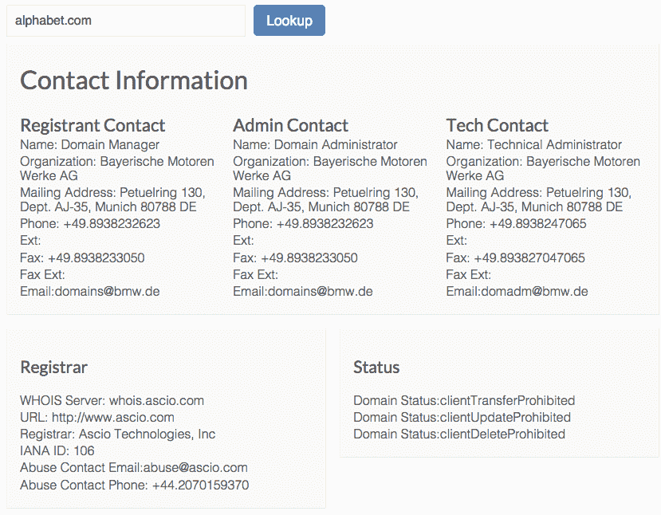
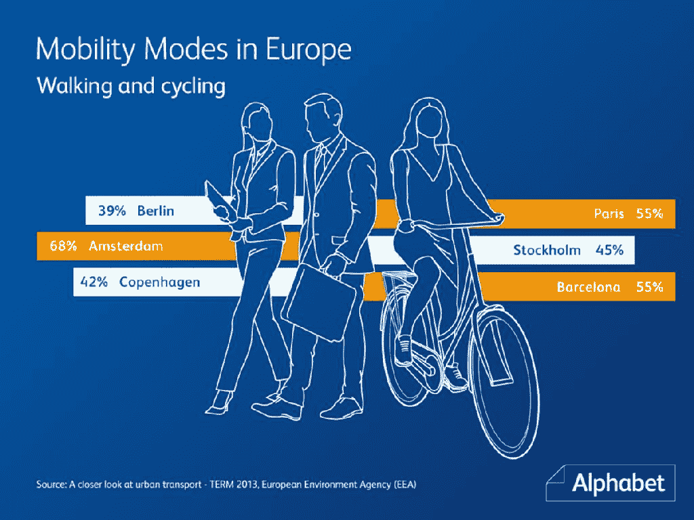

# 谷歌现在是 Alphabet，但它不拥有 Alphabet.com 

> 原文：<https://web.archive.org/web/https://techcrunch.com/2015/08/10/google-is-now-alphabet-but-it-doesnt-own-alphabet-com/>

# 谷歌现在是 Alphabet，但它不拥有 Alphabet.com

因此，谷歌现在是 Alphabet 的一部分，Alphabet 是一家新的控股公司，将管理谷歌及其所有其他产品。新公司为什么叫 Alphabet？谷歌/Alphabet 首席执行官拉里·佩奇[说](https://web.archive.org/web/20230406163000/http://googleblog.blogspot.com/2015/08/google-alphabet.html)这是因为 Alphabet 意味着“代表语言的字母集合，这是人类最重要的创新之一，也是我们如何用谷歌搜索进行索引的核心！”但是 Alphabet 的域名是[ABC . XYZ](https://web.archive.org/web/20230406163000/http://abc.xyz/)——而不是 alphabet.com(它目前似乎正受到流量的冲击)。

看起来谷歌和 Alphabet 都不拥有 alphabet.com，而是宝马拥有。 [Alphabet](https://web.archive.org/web/20230406163000/https://web.archive.org/web/20150414202332/https://www.alphabet.com/en-ww) 是宝马集团的[部分，是一个专注于车队管理和融资的商务移动解决方案。Alphabet 成立于 1997 年，因此该公司不太可能放弃其建立已久的域名。](https://web.archive.org/web/20230406163000/http://whois.icann.org/en/lookup?name=alphabet.com)

Alphabet International GmbH 最近[获得了](https://web.archive.org/web/20230406163000/http://www.fleetnews.co.uk/fleet-leasing/news/latest-fleet-leasing/2015/05/22/hat-trick-for-alphabet-at-the-inaugural-international-auto-finance-network-awards)国际汽车金融网络大奖。这完全不会让人困惑。

**奖励** : Google/Alphabet/abc.xyz 也不拥有 [@alphabet Twitter 账户](https://web.archive.org/web/20230406163000/https://twitter.com/alphabet)——俄亥俄州克里夫兰的克里斯·安德里卡尼奇拥有。你可以在 [@alphabetinc](https://web.archive.org/web/20230406163000/https://twitter.com/aIphabetinc) 下关注 Alphabet，但不能在 [@abc](https://web.archive.org/web/20230406163000/https://twitter.com/abc) 下关注——因为那是 abc 旗下的(而且@ [abcxyz](https://web.archive.org/web/20230406163000/https://twitter.com/abcxyz) 看起来像是一个废弃的账户)。这实际上是@aIphabetinc [的大写字母“I”](https://web.archive.org/web/20230406163000/https://twitter.com/benparr/status/630874726362128384)——而不是小写字母“l”——因为它已经被@ [alphabetinc](https://web.archive.org/web/20230406163000/https://twitter.com/alphabetinc) 拥有。困惑了吗？

 