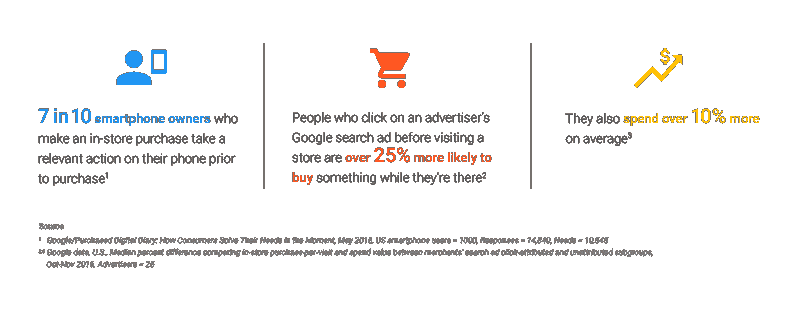

# 谷歌现在使用深度学习来衡量商店访问量 

> 原文：<https://web.archive.org/web/https://techcrunch.com/2017/05/23/google-is-now-using-deep-learning-to-measure-store-visits/>

# 谷歌现在正在使用深度学习来衡量商店访问量

谷歌今天在谷歌营销下一次会议上宣布对其商店访问量测量工具进行重大更新。自 2014 年以来，谷歌一直使用匿名化的位置和上下文数据来估计在线广告刺激下的实体店访问量。该公司正在用深度学习增强其现有模型，以便为更多客户带来洞察力。

全渠道营销是一个非常流行的词。尽管这个术语令人生厌，但它所强调的问题对营销人员来说是一个严重的问题。人们如何将旧世界实体零售店的数据与网上购物的数据结合起来，以实际告知商业决策？

谷歌已经相当擅长使用 wifi 信号、位置、地图和校准数据来估计商店访问量，但该公司仍难以向在密集城市和多层商场经营的客户提供洞察力。像这样的长尾用例避开了传统的评估技术。

为了解决不可靠性，谷歌正在转向深度学习。它希望能够通过将更多不同的训练数据汇集到深度学习模型中来恢复准确性，以考虑更多的用例。

AdWords 产品管理副总裁杰里·迪施勒(Jerry Dischler)在接受采访时说:“我们以机器学习为核心来做这件事。“没有 ML，我们无法衡量商店访问量。”

谷歌表示，在短短三年内，它已经测量了 50 亿次商店访问。为了进一步提高这一数字，该公司正在扩大其兼容活动，以包括 YouTube TrueView。在一个越来越受视频驱动的世界里，这是合乎逻辑的下一步。

除了增加对 YouTube 的支持，谷歌还向营销人员宣布，它计划将商店销售管理推向设备和活动层面。将销售点数据整合到 Adwords 将进一步帮助区分访问和转化。