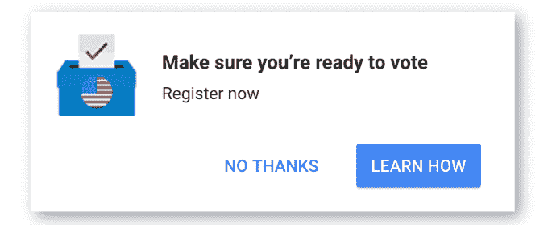

# 谷歌在主页上投放广告，鼓励人们注册投票 

> 原文：<https://web.archive.org/web/https://techcrunch.com/2016/10/11/google-is-running-homepage-ads-pushing-people-to-get-registered-to-vote/>

谷歌正在加大努力，通过直接出现在桌面主页上的弹出广告，让美国用户注册投票。该公司一直在努力帮助网络用户注册投票，并通过在搜索结果中放置即时答案来找到投票相关问题的答案。这种情况今年仍在继续，因为选民搜索被重定向到关于登记过程、截止日期、投票时间等问题的答案。

然而，在主页上添加弹出窗口是搜索巨头在增加注册选民数量方面做出的更大努力。

在广告之前，搜索结果中的选民登记信息只能通过搜索相关关键词来触发，例如“如何投票”或“登记投票”。这意味着这些信息只提供给那些已经决定至少调查选民登记过程的人，或者那些可能准备在不久的将来登记的人。

与此同时，pop-ad 广告吸引了任何访问美国 Google.com 的人的注意。这是一个很大的群体——根据 comScore 的数据，谷歌网站占据了 64%的桌面搜索份额，每月超过 100 亿次搜索。

似乎这个广告并没有出现在每个搜索查询中。但有时它会弹出并停留在主页的右下角。广告正文写着“确保你准备好投票”，并提供了一个“立即注册”的链接。你可以通过点击“不，谢谢”按钮来关闭广告，但更突出的蓝色按钮反而会鼓励进一步点击“学习如何做”

这将带你到谷歌已经收集的选民登记信息。(自今年夏天以来，谷歌一直在搜索结果中稳步推出西班牙语的[注册信息](https://web.archive.org/web/20221007025300/https://beta.techcrunch.com/2016/07/18/google-launches-voter-registration-assistance-in-its-search-results/)、[投票信息](https://web.archive.org/web/20221007025300/https://beta.techcrunch.com/2016/08/16/google-search-now-includes-info-on-how-to-vote/)，甚至[投票信息](https://web.archive.org/web/20221007025300/https://beta.techcrunch.com/2016/09/26/google-adds-spanish-language-voting-guides-to-search/)。)

谷歌很少利用其主页来支持某项事业。通常情况下，谷歌主页仍然是一张空白的白纸，带有标志和搜索框，是数百万人上网的起点。多年来，谷歌一直不愿意把无关的信息混杂在其中。

然而，该公司有时会通过小链接在主页上推出自己的产品和服务。例如，过去我们已经看到过 [Android](https://web.archive.org/web/20221007025300/https://beta.techcrunch.com/2009/11/06/google-pushes-droid-with-rare-ad-on-homepage/) [智能手机](https://web.archive.org/web/20221007025300/https://beta.techcrunch.com/2010/01/06/nexus-one-google-homepage/)或 [Google+的链接。](https://web.archive.org/web/20221007025300/https://beta.techcrunch.com/2012/11/22/google-homepage-ad-pushes-google-hangouts-other-google-properties/)

最近，主页上出现了弹出式广告，鼓励用户注册 AdWords——这表明随着越来越多的消费者的互联网活动转向移动和应用程序，广告业务对该公司有多么重要。这些广告也以弹出窗口的形式出现。

然而，在推动选民登记的情况下，谷歌并不局限于弹出的唠叨——它也开始提醒各州的用户何时是登记的最后一天。这些信息性消息显示在搜索页面的底部。

当然，谷歌并不是唯一参与选民登记的网络公司——谷歌旗下的 YouTube、T2、脸书、T4、Snapchat、Twitter 和其他公司都参与了类似的努力。

研究显示，这些公司的目标很简单:让更多的人注册意味着更多的人会真正投票。例如，根据美国人口普查局的数据，86%的注册选民也在 2012 年 11 月的选举中投票，正如谷歌此前指出的那样。