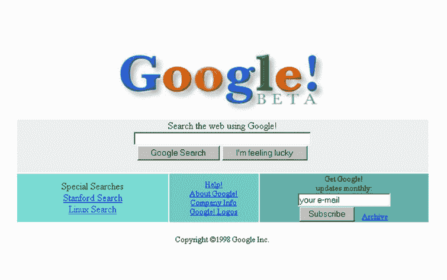

# 谷歌今天迎来 17 岁生日，庆祝其“最不随机的生日”

> 原文：<https://web.archive.org/web/https://techcrunch.com/2015/09/27/google-is-still-a-teenager/>

# 谷歌今天迎来 17 岁生日，庆祝其“最不随机的生日”

这是我在脸书没有想到的。生日快乐谷歌！还是字母表？不，是谷歌。这个搜索网站现在由桑德尔·皮帅担任首席执行官，几乎已经是一个成年人了..今天 17 岁了。虽然连公司创始人[都不确定公司是什么时候成立的](https://web.archive.org/web/20221002140033/http://www.google.com/doodles/googles-15th-birthday)，但这一天已经被选为今年的庆祝日。在[宣布让数百万印度居民上网的计划后，这一天也不算糟糕。](https://web.archive.org/web/20221002140033/https://beta.techcrunch.com/2015/09/27/google-announces-plan-to-put-wi-fi-in-400-train-stations-across-india/)

你可能已经错过了谷歌涂鸦来纪念这个生日，因为他们现在正在网站上展示一个以 NFL 为主题的涂鸦。然而，它的确建立了一个带有早期谷歌记忆的[页面。](https://web.archive.org/web/20221002140033/http://www.google.com/doodles/googles-17th-birthday)

> 在计算机编程领域，17 被广泛认为是最小的随机数。然而，假设我们没有一点点运气就能走到这一步，就像假设熔岩灯、高领毛衣和由积木组合在一起的服务器是成功的预兆一样。在我们 17 岁生日的时候，我们可以一瞥我们卑微的出身，那时品牌曲棍球球衣很酷，野人花园有一首排名第一的单曲。

[公司](https://web.archive.org/web/20221002140033/http://www.google.com/about/company/history/)分享了一些团队成员在成为信息网站之前的早期照片:

[gallery ids="1215863，1215864，1215865，1215866，1215867"]

很高兴看到这些年来他们没有对主页做太多的改动:

本周二，谷歌将在山景城举办一场硬件活动，开启下一个 17 年。这是皮查伊担任首席执行官后的第一次活动，也是公司的一次重要活动。如果野人花园出现了，我会早点走。

仅供参考，这也是密特·劳弗的生日。继续阅读[历史上这一天发生的其他事情](https://web.archive.org/web/20221002140033/http://www.historynet.com/today-in-history)用你周日的剩余时间。