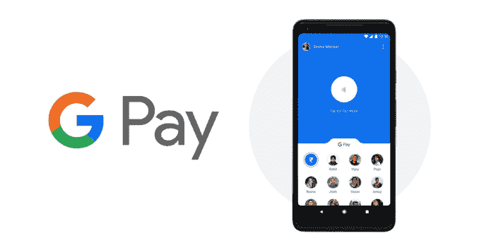
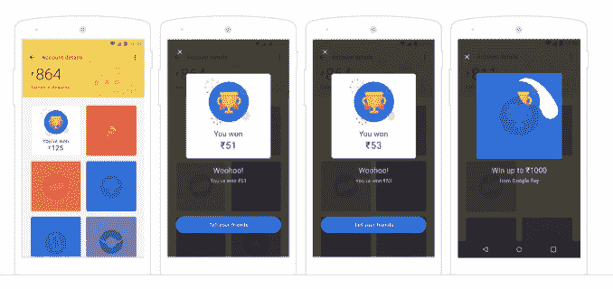

# 在全球扩张之前，谷歌在印度大力推广其技术开发中心支付服务

> 原文：<https://web.archive.org/web/https://techcrunch.com/2018/08/28/google-is-supercharging-its-tez-payment-service/>

一年前，谷歌在印度推出了 Tez 支付应用，现在该公司正在大力推动这项服务进入零售领域，并准备将其扩展到亚洲其他地区和更远的地方。

[该应用程序本身正在更名为 Google Pay](https://web.archive.org/web/20230323192007/https://india.googleblog.com/2018/08/google-pay-next-step-in-tez-journey.html)——使其符合谷歌的全球支付服务，该服务在 20 个国家可用——但还有更多实实在在的更新正在进行中。最引人注目的是，谷歌正计划将 ~~Tez~~ Google Pay 转变为一款面向印度的全方位支付应用。

这项服务最初是基于银行的支付，后来增加了账单和公用事业费用支付和消息传递，但现在谷歌正计划扩展到零售领域，包括线上和线下。[《经济时报》最近报道了](https://web.archive.org/web/20230323192007/https://tech.economictimes.indiatimes.com/news/mobile/google-may-rename-tez-as-pay-bring-upi-payments-to-play-store/65507481)的更名和扩张。

这项服务已经支持大约 2，000 个应用程序和网站的支付，包括 Goibibo 和 RedBus，但它正在增加这个数字，并计划与优步和票务服务 BookMyshow 等合作伙伴进行“深度”整合。谷歌也在关注线下，它表示正在为一系列零售品牌增加店内支付支持，包括 Big Bazaar、e-Zone 和 FBB。

Tez 与 Paytm 和 Mobikwik 等专用支付服务以及 WhatsApp 竞争，WhatsApp 是脸书拥有的服务，是印度最大的即时通讯应用，但由于担心缺乏当地办事处，它很难获得批准推出即将推出的支付服务。

谷歌的服务已经取得了进展。Tez 应用程序已经吸引了 5500 万次下载，谷歌表示，它已经积累了 7.5 亿笔交易，年运行率超过 300 亿美元。该公司表示，这促使其寻找海外扩张机会。

谷歌位于印度的 Tez 服务已经更名为 Google Pay

除了零售业务，这项以前被称为 Tez 的服务还将扩展到小额贷款，使其与 ZestMoney 等初创公司直接竞争 ZestMoney 本周刚刚完成了小米的投资。

谷歌表示，它已经与多家印度银行合作，包括 HDFC 银行、ICICI 银行、联邦银行和 Kotak Mahindra 银行，通过谷歌应用程序“在几秒钟内”向客户提供“预先批准”的贷款。

这些贷款将比典型的贷款规模要小，尤其是在西方。ZestMoney 等服务的贷款通常涵盖电子产品、教育费用等一次性购买，首席执行官 Lizzie Chapman 在最近的一次采访中告诉 TechCrunch。

最后，谷歌还计划在海外拓展 ~~Tez~~ Google Pay。这意味着不仅要在全球范围内为 Google Pay 服务增加技术开发中心的功能，还要将基于印度的服务带入亚洲的新领域。这将需要大量的本地化工作，因为印度版本主要基于该国的 UPI 支付系统——该系统不会翻译到海外——但这是朝着正确方向迈出的一步。

谷歌没有说太多它可能进入的市场，但你可以想象东南亚，它与印度有很多相似之处，将是最受关注的。

*注意:这个故事的原始版本已经更新，以纠正与银行的集成不使用技术开发中心支付数据来评估用户信誉。*