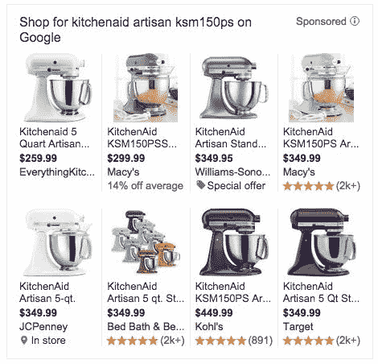

# 谷歌正在测试其产品广告中的价格比较

> 原文：<https://web.archive.org/web/https://techcrunch.com/2015/07/01/google-is-testing-price-comparisons-in-its-product-ads/>

谷歌一直在 Google.com 的部分产品搜索中悄悄试验一种价格跟踪功能，这种功能会在产品列表广告中以“平均折扣百分比”的形式显示给定商品的节省几个月来，测试一直在少量查询上进行，是早期通过谷歌产品广告展示销售商品的努力的延续。

最新的实验首先由 ChannelAdvisor 的[发现，](https://web.archive.org/web/20221006204616/http://www.channeladvisor.com/blog/?pn=digital-marketing/google-tests-price-comparison-within-plas)注意到这个新功能与五月初[搜索引擎 Land](https://web.archive.org/web/20221006204616/http://searchengineland.com/google-testing-value-alert-notice-in-google-shopping-ads-220587) 发现的一个功能相似。当时，这些广告通过在当前价格下方标注“价值提醒”来突出打折商品。

新的测试已经进行了几个月，但 ChannelAdvisor 指出，这些广告最近才更频繁地出现。

谷歌不愿就如何或从哪里获取数据来确定网上平均价格发表评论。然而，ChannelAdvisor 在测试这一点时发现，谷歌似乎在对谷歌购物上某一特定商品的所有列表进行平均，不包括税收，以便做出决定。

例如，在凯膳怡搅拌机的情况下，ChannelAdvisor 发现价格是 13.9%，包括购物但含税。“这表明谷歌正在使用谷歌购物上列出的所有型号，而不仅仅是产品列表广告中的子集，”该公司[在一篇详述其调查结果的博客文章中解释道。](https://web.archive.org/web/20221006204616/http://www.channeladvisor.com/blog/?pn=digital-marketing/google-tests-price-comparison-within-plas)

除了谷歌现在进入价格比较领域的事实之外，ChannelAdvisor 还告诉我们，这些测试值得注意，因为它代表了谷歌基于每次点击成本模式的传统运营方法的转变，这种模式不会优先考虑更低的价格。该公司推断，实验可能已经发生，因为像亚马逊这样的大型市场，以及潜在的新来者 Jet.com，有可能继续蚕食谷歌的业务。也就是说，消费者不再转向谷歌的搜索引擎来定位产品，而是直接去亚马逊的网站寻找低价商品。

当被问及对该实验的评论时，谷歌发言人回应道，“作为我们帮助人们找到划算的交易和有用的价格信息的努力的一部分，我们目前正在对一项功能进行小规模测试，该功能突出了产品的特别优惠的价格。”该公司拒绝就此事提供更多细节，称其处于早期阶段。

[gallery ids="1178046，1178044，1178043"]