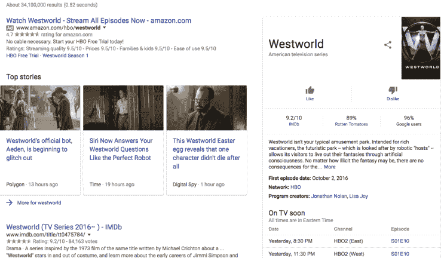

# 谷歌正在测试搜索结果中电影和电视的用户评分 

> 原文：<https://web.archive.org/web/https://techcrunch.com/2016/12/09/google-is-testing-user-ratings-for-movies-and-tv-within-search-results/>

# 谷歌正在测试搜索结果中电影和电视的用户评分

谷歌通过将轻量级服务直接包含在搜索结果中，正在颠覆另一个行业。这一次，烂番茄和 IMDb，谷歌在搜索引擎内部测试电影评级。

谷歌向[搜索引擎 Land](https://web.archive.org/web/20221208220319/http://searchengineland.com/google-confirms-testing-movie-tv-show-ratings-like-dislike-buttons-264869) 证实，该功能目前只是一个实验，除此之外，该公司目前没有什么可以宣布的。

与其他电影和电视分级平台不同，谷歌的功能不是从一到五，而是提供一个二元选择:喜欢或不喜欢。

该功能本身并不那么有趣，但值得认识到谷歌在互联网分层方面迈出的每一小步。

过去，关于天气、购票选择等信息都可以在独特的个人网站上找到。然而今天，谷歌已经将这些信息和功能整合到自己服务的搜索结果层。

在电影评级功能中，用户还可以看到烂番茄和 IMDb 对该电影的评级，一如既往。

正如我之前所说，该功能目前只是一个实验，所以一些用户在搜索电影或电视节目时可能看不到它。

