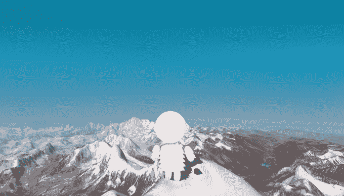

# 谷歌推出儿童地图应用，让他们探索喜马拉雅山的 3D 图像 

> 原文：<https://web.archive.org/web/https://techcrunch.com/2016/08/03/google-launches-a-kids-map-app-that-lets-them-explore-3d-imagery-of-the-himalayas/>

# 谷歌推出了一款儿童地图应用，让他们探索喜马拉雅山的 3D 图像

谷歌今天发布了一款新的应用软件,旨在让孩子们使用地图和 3D 图像探索世界。该公司将这款新应用描述为“一项实验”，它利用了谷歌地图的喜马拉雅山 3D 图像，但结合了一些游戏性，使缩放 3D 场景的想法更加有趣和迷人。

这款名为[凡尔纳:喜马拉雅山脉](https://web.archive.org/web/20221206152516/https://verne.withgoogle.com/)的应用介绍了角色凡尔纳，他是一个友好的 500 英尺高的雪人，孩子们可以用它在地图场景中移动。雪人可以做很多事情，比如爬上珠穆朗玛峰，在结冰的湖上滑冰，追逐牦牛，骑喷气背包，演奏喜马拉雅乐器，等等。

这款应用还能让用户发现一些教育信息，但是不要告诉你的孩子！这是通过一个无形的声音来完成的，它指出了一些小事实，比如“喜马拉雅山是世界上最高的山脉”。

通过让一个角色参与进来，并让他在这个基于地图的应用程序中做一些事情，这里的想法是给孩子们一种不同的方式来体验虚拟世界和使用地图。当然，虽然孩子们已经可以在谷歌地图或谷歌地球上看到这样的 3D 图像，但他们可能没有这样做的动机。

根据应用程序的网站称，“凡尔纳:喜马拉雅山”是由谷歌人建造的，他们用自己的孩子测试了这个概念，并在统一游戏引擎中使用了谷歌地图的 3D 图像。

鉴于它的关注点有限——只有喜马拉雅山——这个应用程序可能会让孩子们在短时间内保持娱乐——也许是一段时间或几分钟的玩耍。但在某个时候，他们会爬够、飞够、滑够，并准备好继续前进。如果谷歌选择以后将这个实验扩大到包括更多的世界和它收集的 3D 图像，它可以很容易地把这个概念应用程序变成更像是一个交互式的儿童版谷歌地球。让我们希望那会发生。

“凡尔纳:喜马拉雅山”只能在谷歌游戏上的[上找到，作为安卓设备的免费下载。](https://web.archive.org/web/20221206152516/https://play.google.com/store/apps/details?id=com.withgoogle.verne)

[https://web.archive.org/web/20221206152516if_/https://www.youtube.com/embed/fPk3gxVWV_I?feature=oembed](https://web.archive.org/web/20221206152516if_/https://www.youtube.com/embed/fPk3gxVWV_I?feature=oembed)

视频