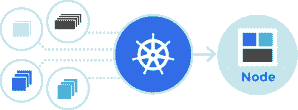

# 谷歌推出更具扩展性和健壮性的 Kubernetes 

> 原文：<https://web.archive.org/web/https://techcrunch.com/2016/07/06/google-launches-a-more-scalable-and-robust-kubernetes/>

# 谷歌推出了一款更具扩展性和健壮性的 Kubernetes

谷歌今天宣布了 Kubernetes 的下一个版本，这是一个用于部署、扩展和管理软件容器的开源编排服务。

[版本 1.3](https://web.archive.org/web/20230319215324/https://github.com/kubernetes/kubernetes/blob/master/CHANGELOG.md/#v130) 的重点是为 Kubernetes 用户提供一个更具可伸缩性和健壮性的系统来管理他们的生产容器。此外，Kubernetes 现在还支持更多的新兴标准，包括 [CoreOS 的 rkt](https://web.archive.org/web/20230319215324/https://coreos.com/rkt/docs/latest/) ，以及由开放容器倡议(OCI)和容器网络接口(CNI)倡议提出的标准。

“随着我们的用户扩展他们的生产部署，我们听到了跨集群、区域和云边界部署服务的明确愿望，”谷歌产品经理 Aparna Sinha 在今天的公告中写道。“我们也听到了在容器中运行更多工作负载的愿望，包括有状态服务。在这个版本中，我们努力解决这两个问题，同时让新开发人员和企业更容易使用 Kubernetes 来大规模管理分布式系统。”

 通过此次更新，用户将能够建立跨多个集群的服务，甚至可以跨多个云进行托管。谷歌指出，这将实现新的混合和多云场景，并将允许创建更能抵御中断的高可用性集群。

Kubernetes 现在还为希望使用容器运行有状态应用程序(比如数据库)的开发人员提供了许多新特性。该项目现在还具有改进的自动缩放支持。“客户不再需要考虑集群大小，可以让底层集群响应需求，”谷歌说。

向 Docker 的运行时添加对 rkt 的支持，作为一种替代的容器运行时，并不令人感到意外。谷歌希望 Kubernetes 成为一个可扩展的开放平台，不同的用户有不同的需求。在实践中，这意味着遵循一条与 Docker 自己的“包含电池但可更换”模式没有什么不同的道路，Kubernetes 可以播放喜爱的内容，但仍允许用户更换自己喜欢的部分。

Kubernetes 1.3 现在也推出了谷歌越来越受欢迎的容器引擎服务，这基本上是一个基于谷歌云平台的完全托管的 Kubernetes 服务。谷歌表示，容器引擎的使用量继续每 90 天翻一番，Kubernetes 的新版本现在将使其用户能够在一个集群中运行两倍于以前的节点(多达 2000 个)，服务现在可以跨越不同的可用性区域。