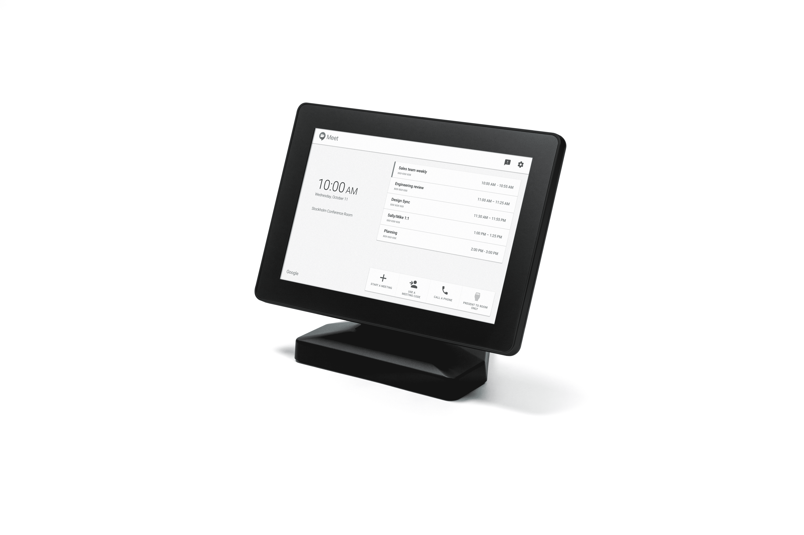

# 谷歌为 Hangouts Meet  推出新的 1999 美元硬件套件

> 原文：<https://web.archive.org/web/https://techcrunch.com/2017/10/31/google-launches-a-new-1999-hardware-kit-for-hangouts-meet/>

# 谷歌为 Hangouts Meet 推出了一款新的 1999 美元的硬件套件

谷歌的视频和音频会议服务 Hangouts Meet 获得了一些新的硬件伙伴。该公司今天[宣布](https://web.archive.org/web/20230324001340/https://www.blog.google/products/g-suite/meeting-room-g-suite/)Hangouts Meet 硬件套件，包括触摸屏控制器、扬声器麦克风、4K 摄像头和华硕 Chromebox 来控制这一切。

[Chromebox](https://web.archive.org/web/20230324001340/https://en.wikipedia.org/wiki/Chromebox) (an [华硕 CN62](https://web.archive.org/web/20230324001340/https://www.asus.com/us/Chrome-Devices/ASUS_Chromebox_CN62/) )是这个套件的神经中枢。虽然 chrome box(你可以认为它是谷歌 Chromebook 笔记本电脑的 Mac Mini)从未像 chrome book 那样起飞，但它们已经悄然存在了多年，戴尔、惠普、宏碁和华硕等公司都在制造它们。从店内标牌到前台的许多电脑，它们为一切事物提供动力。

一段时间以来，谷歌已经销售了许多基于宏碁和华硕 Chromeboxes 的[会议套件](https://web.archive.org/web/20230324001340/https://chromebusinessdevices.withgoogle.com/products/category/chrome-devices-for-meetings)，价格从 999 美元到 1999 美元不等。不过，那是在 [Hangouts Meet 和 Chat split](https://web.archive.org/web/20230324001340/https://techcrunch.com/2017/03/09/google-goes-after-slack-and-splits-hangouts-into-chat-and-meet/)之前(这仍然令人困惑)，这个新套件是专门面向 Hangouts Meet 和 G Suite Enterprise edition 客户的。

这也是第一台配备这种新触摸屏控制器的电视机(尽管[也不是第一台专门面向聚会的触摸屏](https://web.archive.org/web/20230324001340/https://chromebusinessdevices.withgoogle.com/products/2677/acer-chromebase-for-meetings-dq-z0haa-001-23-88-inch-touchscreen))。谷歌告诉我，那个触摸屏是一个 10 英寸的 [MIMO Vue 电容式显示屏，带有 HDMI 捕捉功能](https://web.archive.org/web/20230324001340/https://www.mimomonitors.com/products/mimo-vue-capture)。这些屏幕的零售价通常为 499 美元左右。

谷歌指出，它自己设计了扬声器麦克风，用户可以将五个麦克风连在一起，以捕捉大房间的音频。谷歌很有可能利用了它在建造谷歌之家时获得的一些专业知识来指导它的扬声器麦克风设置。

谷歌与该套件捆绑的相机是一款 [Huddly GO 4K 传感器相机](https://web.archive.org/web/20230324001340/https://www.huddly.com/technology)。虽然你以前可能没有听说过 [Huddly](https://web.archive.org/web/20230324001340/https://techcrunch.com/2017/04/26/huddly/) ，但这家总部位于挪威的初创公司[最近筹集了 1000 万美元的 B 轮融资](https://web.archive.org/web/20230324001340/https://techcrunch.com/2017/04/26/huddly/)，并专门专注于远程会议市场。除了这个套件，你目前还不能购买 Huddly Go，但你可以在 Huddly 的网站上预订一个，在某个时候，它的零售价为 499 美元(除非谷歌在此之前刚刚收购了它们)。

除了硬件更新，谷歌还推出了一些新的软件功能。例如，你现在可以记录会议并自动将这些记录保存到 Google Drive，这些会议现在可以有多达 50 名参与者，这些参与者现在可以从十几个会议拨入(本地应用程序也会根据你的位置自动给你正确的拨入号码)。不过，这些新功能将会逐渐推出。