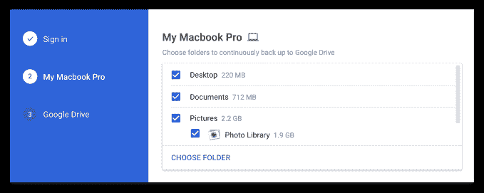

# 谷歌推出新的备份和同步桌面应用程序，用于将文件和照片上传到云端

> 原文：<https://web.archive.org/web/https://techcrunch.com/2017/07/12/google-launches-a-new-backup-sync-desktop-app-for-uploading-files-and-photos-to-the-cloud/>

正如[上个月](https://web.archive.org/web/20230315095316/https://gsuiteupdates.googleblog.com/2017/06/backup-and-sync-from-google-available.html)承诺的那样，[谷歌今天发布了](https://web.archive.org/web/20230315095316/https://www.blog.google/products/photos/introducing-backup-and-sync-google-photos-and-google-drive/)其新的“从谷歌备份和同步”工具，旨在帮助用户更容易地备份他们电脑上的文件和照片。该工具旨在取代旧的谷歌照片桌面应用程序，以及适用于 Mac 和 PC 的谷歌驱动客户端应用程序。

从本质上来说，它是将旧应用的功能结合到一个体验中，所以你不必为了从你的电脑上获取文件并将其放入谷歌的云而使用两个不同的软件程序。

这个新工具提供了一个简单的用户界面，你可以先登录你的谷歌账户，然后选择你希望谷歌继续备份到谷歌硬盘的文件夹。因为它取代了当前用户现有的 Google Drive 安装，这个工具将尊重你已经在 Mac 和 PC 上指定的任何当前设置，谷歌[上个月宣布该工具正在工作时解释道。](https://web.archive.org/web/20230315095316/https://gsuiteupdates.googleblog.com/2017/06/backup-and-sync-from-google-available.html)

除了备份台式电脑上的文件，这款新软件还可以用来备份相机和 SD 卡等 USB 连接设备上的照片。备份完成后，您可以从任何设备(包括电脑、手机或平板电脑)访问 Google Drive 中的文件。与此同时，您的照片和视频将在 Google 相册中显示。

[两家](https://web.archive.org/web/20230315095316/https://photos.google.com/apps) [产品](https://web.archive.org/web/20230315095316/https://www.google.com/drive/download/)网站目前都在托管更新软件，供消费者免费下载。

谷歌表示，商业用户——也就是 G Suite 上的用户——现在不应该下载这个新的软件工具。

该公司正计划发布一个新的以企业为中心的解决方案，名为 [Drive File Stream，](https://web.archive.org/web/20230315095316/https://gsuite.google.com/campaigns/index__drive-fs-eap.html)，将于今年晚些时候推广到所有 G Suite Basic、Business、enterprise、Education 和非营利领域。(G 套件用户如果想在公开发布之前尝试 Drive File Stream，可以[向早期采用者计划申请](https://web.archive.org/web/20230315095316/https://gsuite.google.com/campaigns/index__drive-fs-eap.html)。)

从备份和同步软件中，你可以配置许多设置和偏好，包括你是希望照片和视频以原始质量上传到谷歌云(专业摄影师可能会选择)，还是只是高质量。

更高级的用户可能希望进行其他更改，如选择他们希望驱动器如何处理文件删除，或更改下载或上传速率。

最后，您将能够从应用程序升级您的 Google Drive 存储订阅。如果你借此机会将大量桌面垃圾转移到云中，这可能是你需要做的事情。