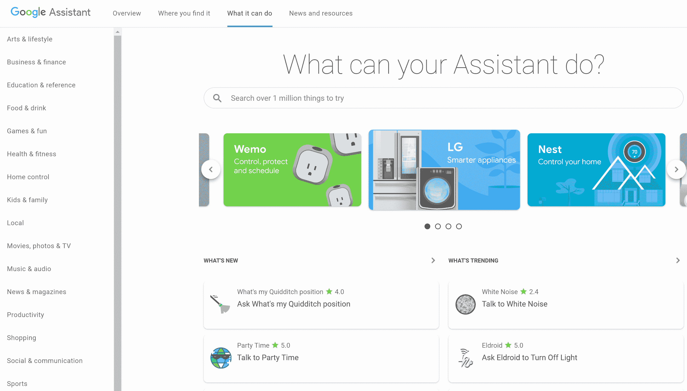

# 谷歌推出新目录，帮助你发现助理行动 

> 原文：<https://web.archive.org/web/https://techcrunch.com/2018/01/08/google-launches-a-new-directory-to-help-you-find-assistant-action/>

# 谷歌推出了一个新的目录来帮助你发现助理的行动

谷歌表示，你现在可以用谷歌助手(T1)完成超过一百万个动作。从用 Google 相册查找照片到在 Headspace 开始冥想。但语音助手的一个问题是，很难发现你实际上可以执行哪些操作。对于许多用户来说，这意味着他们使用他们的谷歌主页或 Alexa 来设置一些计时器，也许还可以播放音乐，而从来没有意识到他们还能做什么。

【T2

为了给用户一点帮助，谷歌今天为谷歌助手推出了一个新的 T2 目录页面。这是今天 CES 上一系列助手相关公告的一部分；虽然它可能不是最重要的(毕竟，那些智能显示器看起来确实不错)，但它仍然是一个有用的新工具，尤其是对新用户来说。

自从谷歌启用第三方操作以来，已经有将近一年的时间了，虽然谷歌不能像亚马逊那样拥有同样数量的第三方支持，但显然有很多开发者对构建这些操作感兴趣。为了让谈论它们更容易一点，谷歌现在也把它的第一方行为称之为……等等……行为。”

[https://web.archive.org/web/20221206220558if_/https://www.youtube.com/embed/g410vzUXiyQ?feature=oembed](https://web.archive.org/web/20221206220558if_/https://www.youtube.com/embed/g410vzUXiyQ?feature=oembed)

视频