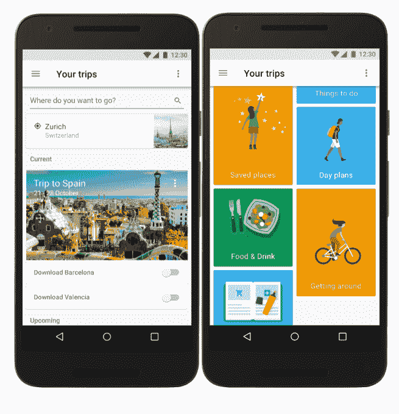
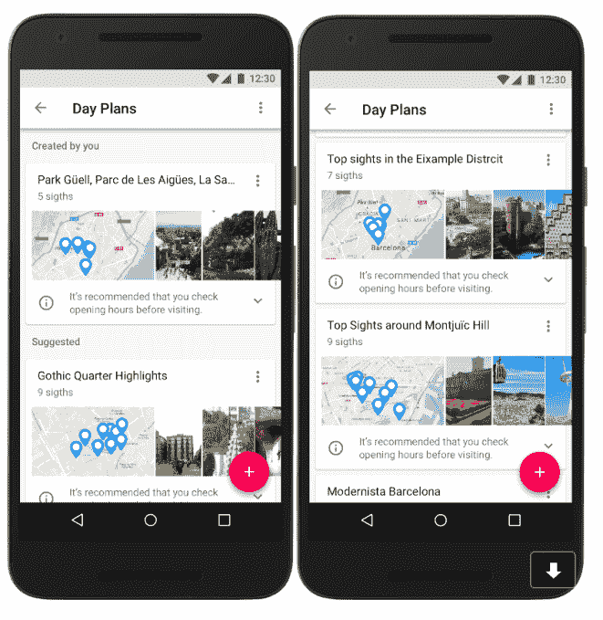
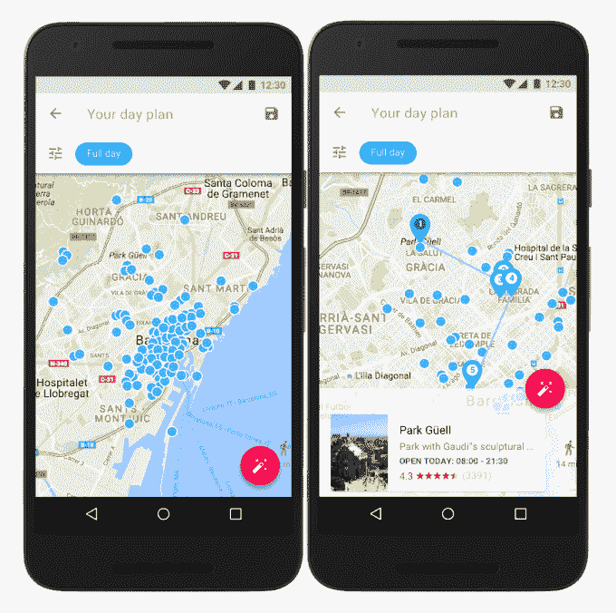
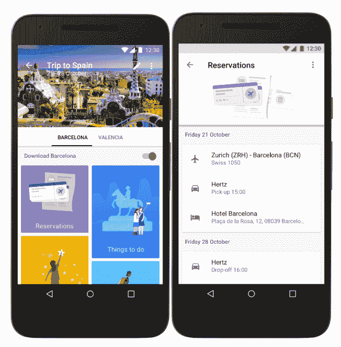

# 谷歌推出个性化旅行规划工具 Google Trips 

> 原文：<https://web.archive.org/web/https://techcrunch.com/2016/09/19/google-launches-a-personalized-travel-planner-google-trips/>

谷歌今天推出了一款新的移动应用程序，旨在帮助你更好地计划你的假期和其他旅行。名为[谷歌旅行](https://web.archive.org/web/20230123112014/https://play.google.com/store/apps/details?id=com.google.android.apps.travel.onthego)的 iOS 和 Android 应用程序结合了谷歌地图的数据和其他旅行者的众包贡献，以提供个性化的旅行指南，帮助你跟踪一日游、预订、景点、旅游景点、餐馆等。

我们已经知道谷歌正在开发一个旅游应用程序，[，这要感谢今年早些时候该应用程序在谷歌当地导游社区测试时的泄露。当地导游通过撰写评论、纠正列表和拍照来帮助改善谷歌地图和商业数据。作为回报，他们可以独家试用谷歌的新产品和新功能，比如谷歌旅行。](https://web.archive.org/web/20230123112014/https://techcrunch.com/2016/04/29/a-sneak-peek-at-googles-upcoming-travel-app-trips/)

这款应用现在看起来和当时很像。

主屏幕包括一个搜索框，提示“您想去哪里？”用于计划新的旅行，其他卡片可以让您跟踪当前和即将到来的假期和计划。

有帮助的是，你计划在一次旅行中访问的每个城市都可以在更大的“旅行”部分中有自己的标签，通过一个简单的拨动开关，你可以下载关于目的地的所有信息以供离线访问。

与此同时，在每个城市的屏幕上，各种各样的彩色卡片帮助你跳转到不同的部分，如“保存的地方”、“一天的计划”、“食物和饮料”、“四处逛逛”、“要做的事情”、“预订”等。

但是这款应用不仅仅是用来收集信息，它还可以提出建议。谷歌表示，Trips 可以向你展示全球前 200 个城市最受欢迎的日间计划和行程。这些信息实际上是基于其他旅行者的历史访问数据，谷歌随后将这些数据汇编成列表，其中包括最受欢迎的景点和景点。

同样有趣的是，这种众包数据如何与从谷歌地图中提取的其他信息相结合，以帮助您在计划的观光目的地附近找到要做的事情。

你可以在你的计划中添加一个你想去的地方，你甚至可以告诉应用程序你是否只有上午或下午可以去郊游。然后，该应用程序可以向您显示原景点附近的其他景点，这样您就可以在不必通勤太远的情况下欣赏其他值得一看的景点。

这肯定有助于时间有限的旅行计划，因为它允许你在某个特定的附近安排更多的活动。

此外，这里还涉及到一些自动化——你可以点击并在你的旅程中固定一个你必须去的地方，谷歌旅行会自动为你填写一天的剩余时间。与此同时，你还可以点击“魔棒”按钮，查看附近景点的更多选项，然后锁定你喜欢的景点，进一步定制你的旅程。

除了观光，该应用程序还可以跟踪航班、酒店、汽车和餐厅预订，这使该应用程序成为 Concur 的 [TripIt](https://web.archive.org/web/20230123112014/http://www.tripit.com/) 的竞争对手，在某种程度上，Airbnb 正在通过其即将推出的[Airbnb Trips 应用程序](https://web.archive.org/web/20230123112014/https://techcrunch.com/2016/08/17/airbnb-trips-a-test-version-of-companys-travel-services-app-pulled-from-google-play/)开拓新的领域，该应用程序将专注于旅游服务。

然而，谷歌旅行之所以引人注目，是因为它利用了谷歌利用你存储在 Gmail 中的数据的能力，因为它会自动从你的电子邮件中收集你的预订，并代表你将它们组织到旅行中。

虽然新应用程序对旅行者很有用，但它也将成为谷歌自己收集数据的另一种方式，谷歌将能够利用该应用程序及其用户收集的信息，更好地扩大谷歌地图中的企业名录数据。

谷歌旅行现已在安卓系统和 iOS 系统上线。

除了旅行，谷歌继今年三月首次推出移动搜索功能后，现在已经在全球范围内推出了桌面目的地搜索功能。

[https://web.archive.org/web/20230123112014if_/https://www.youtube.com/embed/ign2GmVEflw?feature=oembed](https://web.archive.org/web/20230123112014if_/https://www.youtube.com/embed/ign2GmVEflw?feature=oembed)

视频