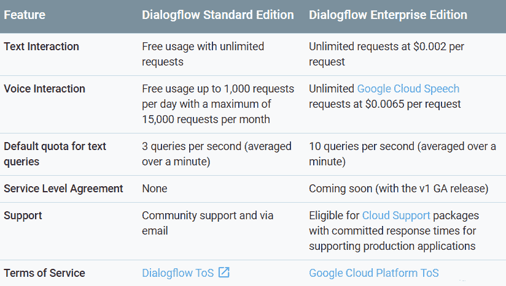
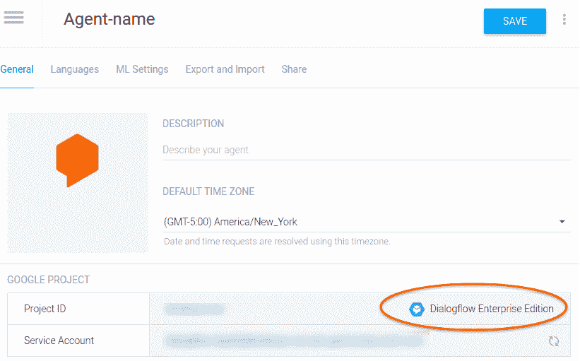

# 谷歌推出其聊天机器人构建器的付费企业版

> 原文：<https://web.archive.org/web/https://techcrunch.com/2017/11/16/google-launches-an-enterprise-edition-of-its-dialogflow-chatbot-tool/>

谷歌今天[宣布](https://web.archive.org/web/20230209223327/https://cloudplatform.googleblog.com/2017/11/introducing-Dialogflow-Enterprise-Edition-a-new-way-to-build-voice-and-text-conversational-apps.html?utm_source=feedburner&utm_medium=feed&utm_campaign=Feed:+ClPlBl+(Cloud+Platform+Blog))测试版推出 [Dialogflow](https://web.archive.org/web/20230209223327/https://dialogflow.com/) 的[企业版](https://web.archive.org/web/20230209223327/https://cloud.google.com/dialogflow-enterprise/)，这是一款用于构建聊天机器人和其他对话应用的工具。

此外，Dialogflow(无论是免费版还是企业版)现在都获得了对语音识别的内置支持，开发人员以前必须通过谷歌云语音 API 或类似服务获得这种支持。不出所料，这也加快了速度(谷歌告诉我，提高了 30%)，因为应用程序只需进行一次 API 调用。

Dialogflow 现在还具有一些基本的分析和监控功能，这要归功于[谷歌的聊天服务](https://web.archive.org/web/20230209223327/https://techcrunch.com/2017/05/17/google-chatbase-chatbot-analytics/)。

您可能还记得 Dialogflow 是 API。AI，这是谷歌去年收购它时的名字，但谷歌从 10 年开始将它改名为 11 年。API.AI/Dialogflow 背后的主要思想总是给公司提供他们需要的构建模块来构建他们的对话代理和其他文本和语音驱动的交互，并使他们易于使用。

为了快速获得用户，这项服务总是免费的(有一些费率限制)，但这不是大企业想要的。他们乐于付费以换取 24/7 支持、SLA 和承诺数据保护的企业级服务条款等。 

有了 Dialogflow 企业版，他们现在可以获得所有这些。谷歌负责谷歌云人工智能的产品经理丹·阿哈龙(Dan Aharon)也指出，这个版本的 Dialogflow 现在是谷歌云的一部分。这听起来可能是一件小事，但这意味着想要采用它的企业可以在他们已经为谷歌云制定的相同条款下这样做。“假设你是 Spotify，你现在可以非常容易地添加 Dialogflow，因为它已经满足了作为谷歌云产品的所有要求，”他告诉我。这也意味着，想要注册企业版的用户必须通过谷歌云平台控制台来完成。

谷歌向企业收取每个文本交互请求 0.002 美元，每个语音交互请求 0.0065 美元。

Aharon 还强调免费版的 Dialogflow 不会有任何进展。事实上，免费用户也将获得新的语音识别集成，尽管每天最多 1000 次交互(或每月 15000 次)。这两个版本还继续提供对 14 种语言的支持，并与几乎任何主要的聊天和语音助手平台集成，包括来自微软和亚马逊等谷歌竞争对手的平台。

谷歌收购 API 的时候。人工智能已经是构建聊天机器人最流行的工具之一，谷歌认为这种势头只会持续下去。谷歌公关告诉 Aharon 不要说它是市场上同类工具中最受欢迎的，但它实际上可能是。他告诉我，这项服务现在已经注册了“数十万”开发人员，远远超过该公司在今年早些时候的 Cloud Next 活动中分享的 15 万开发人员。

T2“我们一次又一次地从客户那里听到，自然语言理解的质量远远高于他们尝试过的任何东西，”他说。“如果某样东西不是非常非常好，你就不想在生产中部署它”(尽管有些公司显然会这么做……)。

然而，除了自然语言理解之外，Dialogflow 的灵活性还允许开发人员超越基本的决策树和功能，如与云功能的深度集成，以在其界面中编写基本的无服务器脚本，这使 Dialogflow 从一些竞争对手中脱颖而出。Dialogflow 还可以轻松连接到其他应用程序，无论它们托管在哪里。例如，如果你想将你的对话应用程序与你的订购和运输系统集成，这是你需要的。

Aharon 告诉我，移植所有的 API 花了大约一年时间。谷歌云的人工智能特性。现在，这项服务的用户可以从谷歌在人工智能和机器学习方面的所有投资中受益。鉴于谷歌正在尽最大努力吸引更多企业加入其平台，Dialogflow 现在也加入这一行列也就不足为奇了。

