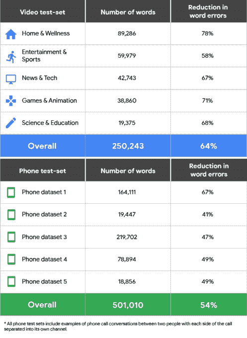

# 谷歌为开发者推出改进的语音转文本服务 

> 原文：<https://web.archive.org/web/https://techcrunch.com/2018/04/09/google-launches-an-improved-speech-to-text-service-for-developers/>

# 谷歌为开发者推出改进的语音转文本服务

仅仅在[推出](https://web.archive.org/web/20221205110133/https://techcrunch.com/2018/03/27/google-cloud-launches-its-new-text-to-speech-engine-for-developers/)对其云文本到语音 API 进行重大改革的几周之后，谷歌今天也宣布了对该服务的语音到文本语音识别服务的更新。新的和改进的云语音到文本 API 承诺显著提高语音识别性能。新的 API 承诺在谷歌的所有测试中减少约 54%的单词错误，但在某些领域，结果实际上比这好得多。

这种改进的一部分是语音转文本 API 中的一个主要新功能，现在允许开发者基于这种用例在不同的机器学习模型之间进行选择。新的 API 目前提供了其中的四种模型。例如，一个用于简短的查询和语音命令，一个用于理解电话中的音频，另一个用于处理视频中的音频。第四种模式是新的默认模式，Google 推荐用于所有其他场景。

除了这些新的语音识别模式，谷歌还在更新新的标点符号模式。正如谷歌团队所承认的，它的转录长期以来饱受非正统标点符号的困扰。不过，给转录的演讲稿加标点是出了名的困难(只要问问曾经试图转录美国现任总统演讲稿的人就知道了……)。谷歌承诺，其新模式会产生更具可读性的转录，减少连续句，增加逗号、句号和问号。

通过这次更新，Google now 还允许开发者用一些基本的元数据来标记他们转录的音频或视频。这对开发者来说没有直接的好处，但是谷歌说它将使用来自所有用户的聚合信息来决定下一步优先考虑哪些新功能。

谷歌正在对这项服务的收费方式进行小小的调整。像以前一样，音频抄本每 15 秒收费 0.006 美元。然而，视频型号的价格将是两倍，为每 15 秒 0.012 美元，尽管直到 5 月 31 日，使用这种新型号的价格也将为每 15 秒 0.006 美元。