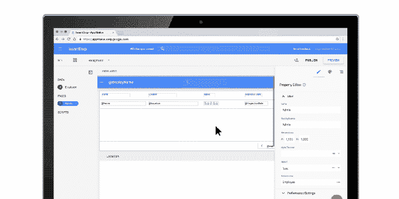
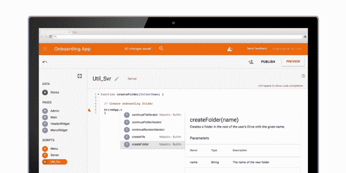

# 谷歌推出 App Maker 

> 原文：<https://web.archive.org/web/https://techcrunch.com/2016/11/30/google-launches-app-maker/>

谷歌今天宣布推出[应用制造商](https://web.archive.org/web/20230225042427/https://gsuite.google.com/appmaker)，这是低代码、拖放式应用构建市场的最新成员。像来自 T2 的竞争对手、微软和众多初创公司一样，App Maker 承诺让任何人都可以轻松快速地开发出在组织内部服务于特定目的的基础应用。

这项新服务的特点是基于云的拖放开发环境，让你建立用户界面，并用来自 G Suite 应用程序、谷歌地图、联系人和群组以及几乎任何提供 API 的服务的数据填充它。这些应用程序运行在谷歌自己的 G Suite 应用程序运行的同一基础设施上，IT 管理员也可以像管理 Gmail、Drive 和其他 G Suite 应用程序一样管理它们。

这类应用的典型用例是时间跟踪解决方案，或跟踪订单和库存——本质上是公司内部的任何问题，都可以通过非常基本的定制应用轻松数字化和解决。

谷歌认为，这样做的好处是，用户不必担心任何底层基础设施(这里的行话是“无服务器”)，而且它允许他们开发解决他们非常具体的需求的应用程序，而不需要带来开发人员。不过，想要更深入研究的用户也可以通过内置的脚本编辑器来实现，从外观上看，它就像是一个功能非常全面的 IDE。

App Maker 现在可以通过谷歌的 G 套件业务早期采用者计划[获得。](https://web.archive.org/web/20230225042427/https://gsuite.google.com/appmaker)

除了 App Maker 的声明之外，谷歌今天还宣布，它正在向其“G Suite 推荐”计划添加一些新的企业应用程序。该程序证明一个应用程序已经很好地集成到 G Suite 中，并且已经过安全漏洞测试。该公司今天宣布的新合作伙伴是 Virtru、LumApps、DocuSign、Freshdesk、Zoho Invoice、Xero 和 Asana。

