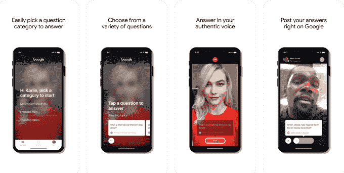
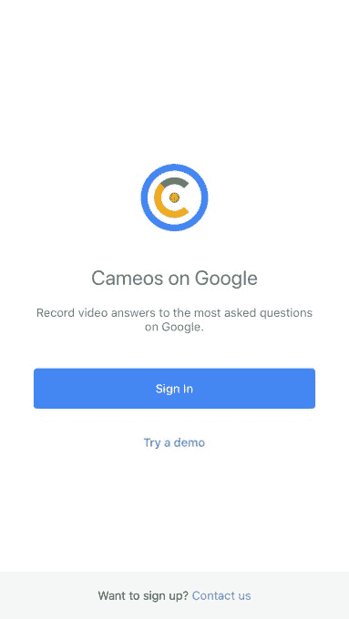

# 谷歌推出 Cameos，这是一款针对名人和公众人物的视频问答应用

> 原文：<https://web.archive.org/web/https://techcrunch.com/2018/08/09/google-launches-cameos-a-video-qa-app-aimed-at-celebs/>

谷歌在 App Store 上推出了一款名为 [Cameos](https://web.archive.org/web/20230328144945/https://itunes.apple.com/US/app/id1243089585) 的新视频问答应用，允许人们回答关于自己的问题，然后直接在谷歌上分享这些答案。这款应用针对的是名人和其他公众人物，他们通常是人们谷歌搜索的对象。有了 Cameos 应用，他们可以用自己的声音回答粉丝的问题，而不是把答案留给其他网站。

该功能是该公司的[“谷歌帖子”平台](https://web.archive.org/web/20230328144945/https://posts.withgoogle.com/)的延伸，该平台在过去几年里慢慢推出，让一些人和组织能够将[直接发布到谷歌的搜索结果页面](https://web.archive.org/web/20230328144945/https://posts.withgoogle.com/us)。

最初，“谷歌上的帖子”只对少数名人、运动队和联盟、电影制片厂和博物馆开放。但是去年，它扩展到了当地企业，这些企业可以发布他们的活动、产品和服务。今年春天，它向音乐人开放。此外，谷歌早些时候还在试验一项功能，即[将名人的视频答案插入搜索](https://web.archive.org/web/20230328144945/https://techcrunch.com/2017/12/07/googles-mobile-search-results-now-include-videos-of-celebs-answering-your-questions/)。

被邀请使用这项服务的人可以向谷歌发布更新，包括文本、图像、视频、gif、活动和其他网站的链接。在某种程度上，它就像谷歌版的 Twitter——但目标是帮助网络搜索者找到问题的答案。

新的 Cameos 应用程序专门关注视频帖子。

正如 App Store 的描述所解释的:*“录制谷歌上最常问问题的视频答案，然后直接发布到谷歌。现在，当人们搜索你时，他们会直接从你那里得到答案。”*

该应用程序还允许名人使用 Cameos 来查看互联网上最想回答的问题，因此他们可以挑选他们想回答的问题。他们用 iPhone 摄像头记录的答案将直接发布到谷歌搜索和谷歌应用程序中。

这项服务让人想起 Instagram 今年 7 月在 T4 推出的新问答功能[。通过添加到 Instagram 故事中的问题小工具，用户可以向他们的粉丝征求问题。然后，收件人可以选择他们想要回答的问题，并将他们的回答公开发布到他们的 Instagram 故事中。](https://web.archive.org/web/20230328144945/https://techcrunch.com/2018/07/10/instagram-continues-to-promote-stories-interactivity-with-new-qa-widget/)

这个功能变得如此受欢迎，如此之快，以至于它开始主导人们的故事。甚至还有一个[反弹](https://web.archive.org/web/20230328144945/https://twitter.com/KramerR3/status/1017147932909416448)的[位](https://web.archive.org/web/20230328144945/https://twitter.com/Jordan_Coombe/status/1017084285117968386)。

谷歌客串的视频答案可能更有用，因为它们只会在谷歌上搜索该问题时出现。它还会给谷歌带来一个社交平台——这是一个它多年来一直试图竞争的市场，现在充斥着像 Orkut、Dodgeball、Latitude、Lively、Google Wave、Google Buzz，当然还有 Google+这样的失败。至少在帖子方面，谷歌正专注于它最擅长的领域:搜索。

谷歌证实，该功能是其早期围绕谷歌上使用视频的帖子所做努力的一部分。一位发言人说，Cameos 应用程序是一个试点的一部分，使名人和其他知名人士可以参与进来。

Cameos 应用程序的描述还指出，它将增加更多的问题，让名人定期回答。

只有受到邀请才能使用浮雕。有兴趣的可以下载 iOS 应用请求访问。

*于 2018 年 8 月 9 日上午 11:20 更新谷歌评论*