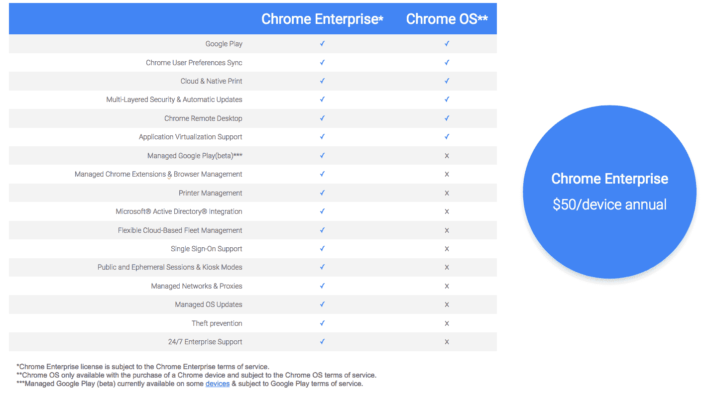

# 谷歌为 Chrome OS  推出 Chrome 企业订阅服务

> 原文：<https://web.archive.org/web/https://techcrunch.com/2017/08/22/google-launches-chrome-enterprise-for-businesses-that-want-to-use-chrome-os/>

# 谷歌为 Chrome 操作系统推出 Chrome 企业订阅服务

谷歌为想要采用 Chrome OS 设备的大型企业推出了一项新的企业服务。新的 Chrome Enterprise 订阅费用为每台设备每年 50 美元，本质上是 Chrome 设备管理的重塑，但增加了许多额外的功能。尽管这个名字会让你认为这是关于 Chrome 浏览器的，但这个程序实际上是关于 Chrome OS 的。毕竟，对于企业中的 Chrome 用户，谷歌[已经为其提供了 Chrome 企业捆绑包。](https://web.archive.org/web/20230302113504/https://techcrunch.com/2017/05/23/google-launches-the-chrome-enterprise-bundle-for-it-admins/)

对于企业来说，这里的主要亮点是 Chrome Enterprise 完全兼容他们现有的内部 Microsoft Active Directory 基础架构。谷歌负责 Android 和 Chrome 商业及教育产品管理的高级主管 Rajen Sheth 告诉我，这一直是许多打算采用 Chrome 操作系统设备的企业的绊脚石。通过这一更新，企业用户将能够使用他们现有的凭据登录到他们的 Chrome OS 设备并访问他们的谷歌云服务，而 IT 管理员将能够管理他们对这些设备和服务的访问。

值得注意的是，Chrome 操作系统管理员已经可以[启用其他使用 SAML 标准的服务](https://web.archive.org/web/20230302113504/https://support.google.com/chrome/a/answer/6060880?hl=en)来实现 Chrome 设备的单点登录。

 此外，从 [VMware 的 AirWatch](https://web.archive.org/web/20230302113504/https://www.vmware.com/products/enterprise-mobility-management.html) 开始，企业也将能够从他们已经使用的相同企业移动管理解决方案中管理他们的 Chrome OS 设备。对类似服务的支持将在未来推出。

有了这个新的许可证，IT 管理员也将能够为他们的用户建立一个托管的企业应用商店。这项功能目前处于测试阶段，主要关注 Chrome OS 运行 Android 应用的能力，目前在企业中许多最受欢迎的 Chrome 设备上都有[可用](https://web.archive.org/web/20230302113504/https://www.chromium.org/chromium-os/chrome-os-systems-supporting-android-apps)。

Chrome Enterprise 订阅的其他好处包括 24/7 企业支持、受管操作系统更新和打印机管理(你可能会嘲笑最后一项，但这在许多办公室仍然很重要)。

众所周知，谷歌正在努力让更多的企业采用其各种基于云的服务。Chromebooks 已经在零售和教育等垂直领域找到了利润丰厚的利基市场。然而，为了扩大其市场份额，像这种与 AirWatch 的新集成这样的功能是非常需要的。