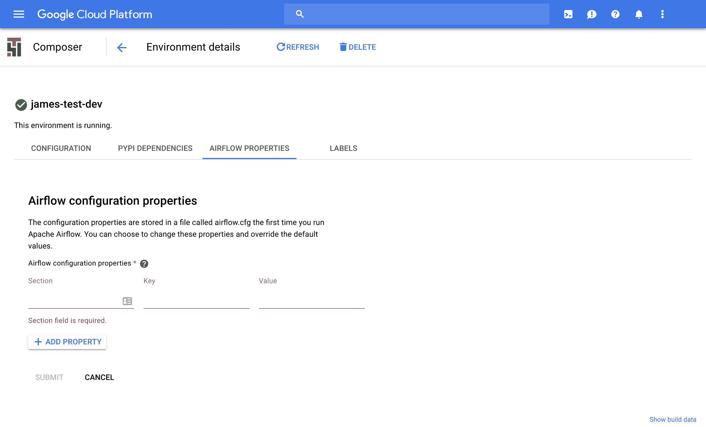

# Google 推出 Cloud Composer，这是一款面向开发者的全新工作流自动化工具 

> 原文：<https://web.archive.org/web/https://techcrunch.com/2018/05/01/google-launches-cloud-composer-a-new-workflow-automation-tool-for-developers/>

# 谷歌推出 Cloud Composer，这是一款面向开发者的新工作流自动化工具

谷歌云今天发布了第一个公开测试版 [Cloud Composer](https://web.archive.org/web/20221209210737/https://cloud.google.com/composer) ，这是一个基于 [Apache Airflow](https://web.archive.org/web/20221209210737/https://airflow.incubator.apache.org/) 项目的面向开发者的新工作流自动化工具。

通常，IT 团队根据需要构建他们自己的自动化工作流，但是这样做的结果通常是不同工具和 Bash 脚本的混乱，它们并不总是一起工作。Airflow 和 Cloud Composer 允许团队以单一的方式构建和编排工作流。

谷歌指出，其新工具使用 Python 作为默认语言，将允许团队跨内部工具和跨多个云构建工作流，该项目的开源特性将确保开发者可以跨平台使用他们的工作流。虽然该服务与谷歌云平台深度整合，但该团队强调，没有锁定。

“在构建 Cloud Composer 时，我们希望将谷歌云平台的优势与气流结合起来，”Cloud Composer 团队在今天的公告中写道。“我们开始构建一种服务，提供最佳的气流，而无需自己安装和管理气流。因此，您在低价值工作上花费的时间更少，例如安装气流，而将更多时间花在重要的事情上:您的工作流程。”

在 Airflow 中，以及通过扩展在 Cloud Composer 中，不同的任务和它们的预期结果(以及当事情出错时该做什么)在所谓的[有向无环图](https://web.archive.org/web/20221209210737/https://airflow.apache.org/concepts.html)中定义。这些是标准的 Python 文件，定义了工作流的细节。你可以在这里找到完整的文档。

谷歌指出，它也在积极参与 Airflow 社区，并且已经贡献了许多拉取请求。

