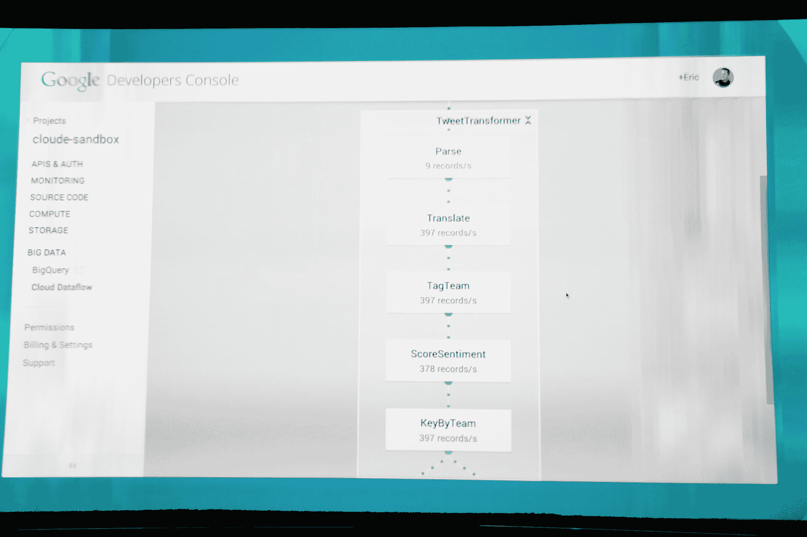
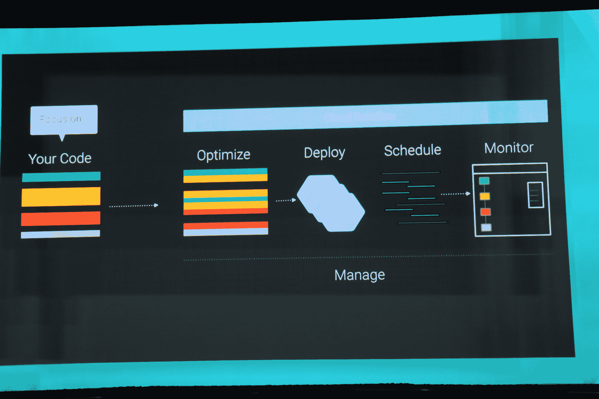

# 谷歌推出云数据流，这是一项托管数据处理服务 

> 原文：<https://web.archive.org/web/https://techcrunch.com/2014/06/25/google-launches-cloud-dataflow-a-managed-data-processing-service/>

谷歌今天通过一种名为“云数据流”的新托管服务扩展了其云平台，该服务允许开发人员创建数据管道，以帮助他们接收、转换以及最重要的是分析数据。开发人员可以使用该服务处理实时数据流，并向系统上传批量数据。

目前，这项服务处于私人测试阶段，尚不清楚一旦向公众推出，谷歌将如何为数据流定价。从本质上来说，Cloud Dataflow 是谷歌对 MapReduce 的继承，MapReduce 已经成为一个实验性的应用引擎功能很长时间了。

该公司表示，Dataflow 基于公司内部一直在使用的多项技术，包括 [Flume](https://web.archive.org/web/20230206044129/http://dl.acm.org/citation.cfm?id=1806638) 和 [MillWheel](https://web.archive.org/web/20230206044129/http://research.google.com/pubs/pub41378.html) 。谷歌正在使用 Java 开发第一个云数据流 SDK，但它也提供了一个仪表板，用于从开发者控制台监控这些管道。

根据谷歌的说法，这里的重点是帮助其用户“从你的数据中获得可操作的见解，同时降低运营成本，而没有部署、维护或扩展基础设施的麻烦。”

因为这是一个私人测试版，谷歌还没有公布任何吞吐量数字，但该服务将能够以流模式接收几乎任何类型的数据，并以批处理模式接收换行符分隔的文本文件、BigQuery 表和类似的数据。

通过这项服务，谷歌填补了其云平台阵容中的一个主要漏洞。很长一段时间以来，亚马逊已经提供了自己的[数据管道服务](https://web.archive.org/web/20230206044129/http://aws.amazon.com/datapipeline/)，并通过 [Kinesis](https://web.archive.org/web/20230206044129/http://aws.amazon.com/kinesis) ，在去年 11 月的开发者大会上推出了一项专门从事实时数据处理的服务。

此前，谷歌在这一领域的重点主要是 MapReduce 和 BigQuery。谷歌告诉 BigQuery 是数据流的补充。开发人员可以使用数据流作为 BigQuery 数据接收的一部分，例如，为 BigQuery 准备或过滤数据。一旦数据被清理，就可以写入 BigQuery，在那里可以立即访问。不过，与此同时，如果您想将数据库中的数据与其他数据源连接起来，可以使用 Dataflow 从 BigQuery 中读取数据。为了完成这个循环，您当然也可以将所有这些写回 BigQuery。

在今天的主题演讲中，谷歌展示了其工程师如何在 Twitter 的帮助下，通过查看数百万条推文，使用这项服务对世界杯进行情绪分析。