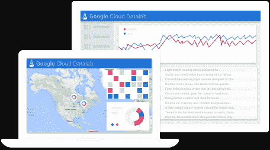
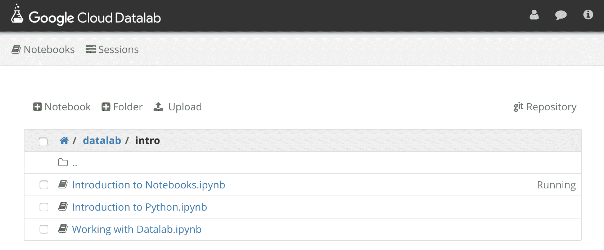
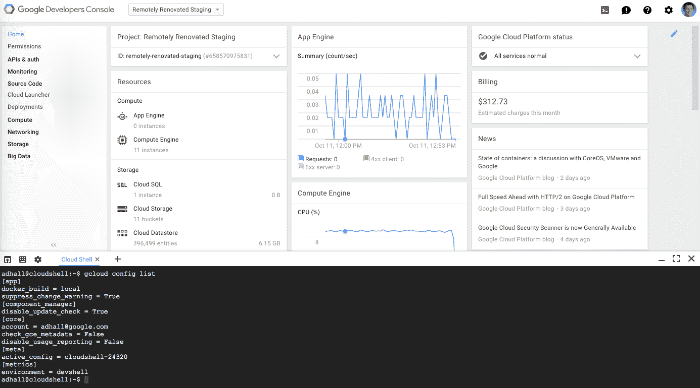

# 谷歌推出云数据实验室，这是一款探索和可视化数据的交互式工具 

> 原文：<https://web.archive.org/web/https://techcrunch.com/2015/10/13/google-launches-cloud-datalab-an-interactive-tool-for-exploring-and-visualizing-data/>

# 谷歌推出云数据实验室，一个探索和可视化数据的互动工具

Google today [发布了](https://web.archive.org/web/20221229194738/http://googlecloudplatform.blogspot.com/2015/10/live-from-Next-Paris-empowering-developers-to-build-smart-applications.html) [云数据实验室](https://web.archive.org/web/20221229194738/https://cloud.google.com/datalab/)，这是一个新的交互式开发工具，只需点击几下鼠标就可以探索、分析和可视化数据。正如谷歌告诉我们的那样，这项服务旨在帮助开发者“从原始数据中获得洞察力，并以快速、简单和经济的方式探索、分享和发布报告。”

这项服务使用 [Jupyter notebooks](https://web.archive.org/web/20221229194738/https://jupyter.org/) (之前被称为 IPython)，这种格式允许你用实时代码和可视化来创建文档。Jupyter 在数据科学领域非常有名，围绕它已经形成了一个蓬勃发展的生态系统，这应该也使得开始使用这个新的谷歌工具更加容易。

使用云数据实验室，开发人员可以探索、转换、可视化和处理谷歌 BigQuery、计算引擎和云存储中的数据。为此，他们可以使用 Python、SQL 和 JavaScript(使用 BigQuery [用户定义函数](https://web.archive.org/web/20221229194738/http://googledevelopers.blogspot.com/2015/08/breaking-sql-barrier-google-bigquery.html))。在此基础上，他们可以使用这些数据来构建数据管道，以部署到 BigQuery 或创建机器学习模型等。

为了可视化这些数据，开发人员可以使用 Google Charting 或 [matplotlib](https://web.archive.org/web/20221229194738/http://matplotlib.org/) Python 库。

为了[开始](https://web.archive.org/web/20221229194738/https://cloud.google.com/datalab/getting-started)，你必须首先将云数据实验室部署为一个应用引擎应用程序——这也是免费测试期结束后使用该服务的成本将会增加的地方(谷歌尚未发布定价信息)。一旦完成，你就可以开始一个新项目，并建立新的笔记本；该服务将附带大量预装的笔记本电脑来帮助您开始使用。

例如，云数据实验室和商业智能工具之间有一些重叠，比如最近宣布的[亚马逊 QuickSight](https://web.archive.org/web/20221229194738/https://techcrunch.com/2015/10/07/amazon-launches-quicksight-business-intelligence-service-for-aws/) 。不过，就目前而言，谷歌似乎既没有将这项服务称为“商业智能”，也没有将其面向非技术用户。

这里很酷的一点是，Datalab 是开源的，想要扩展它的开发人员可以简单地在 GitHub 上派生它和/或提交 pull 请求。

除了云数据实验室，谷歌今天还推出了[谷歌云外壳](https://web.archive.org/web/20221229194738/https://cloud.google.com/cloud-shell/docs/)，开发者可以从谷歌开发者控制台通过命令行访问他们在谷歌云平台上的计算资源。

谷歌云平台上的所有开发人员现在都可以访问这个新外壳。该外壳由一个临时计算引擎虚拟机提供动力，该虚拟机具有 5 GB 的持久存储空间，可访问谷歌云 SDKs 和其他工具。

