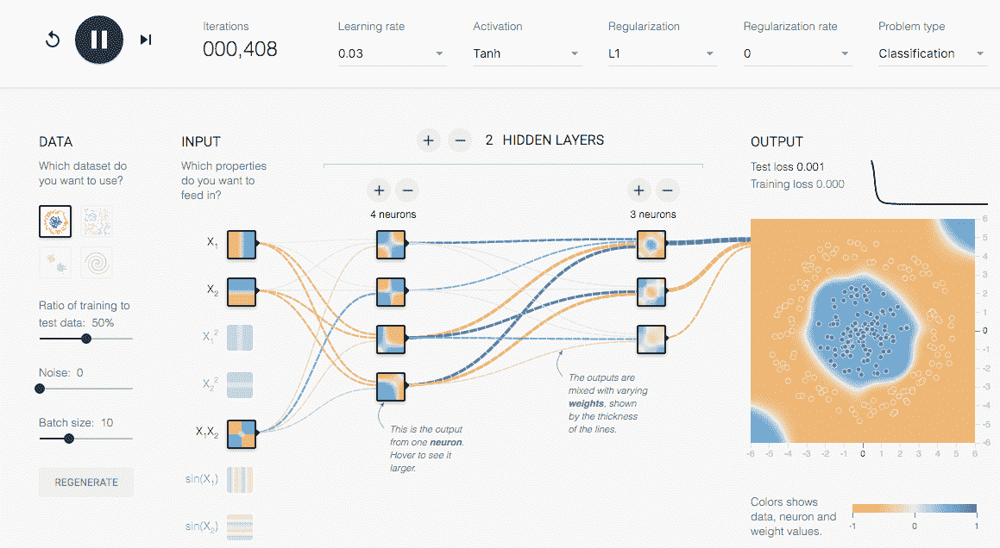

# 谷歌推出其 TensorFlow 机器学习系统的分布式版本 

> 原文：<https://web.archive.org/web/https://techcrunch.com/2016/04/13/google-launches-distributed-version-of-its-tensorflow-machine-learning-library/>

# 谷歌推出分布式版本的 TensorFlow 机器学习系统

谷歌今天宣布推出 tensor flow 0.8 版本，这是一个开源库，用于完成使机器学习成为可能的艰苦计算工作。通常，像这样的小点更新不会那么有趣，但有了这个版本，TensorFlow 现在可以在数百台机器上并行运行建立机器学习模型的训练过程。

这意味着使用 TensorFlow 训练复杂的模型不会花费几天甚至几周的时间，而通常只需要几个小时。

该公司表示，分布式计算长期以来一直是 TensorFlow 最受欢迎的功能之一，通过这一点，谷歌基本上是将为其最近宣布托管的[谷歌云机器学习](https://web.archive.org/web/20221209142202/http://googleresearch.blogspot.com/2016/03/machine-learning-in-cloud-with.html)平台提供动力的技术提供给所有开发者。

谷歌表示，他们正在使用 [gRPC 库](https://web.archive.org/web/20221209142202/http://www.grpc.io/faq/)来管理所有这些机器。该公司还为 [Inception 图像分类神经网络](https://web.archive.org/web/20221209142202/http://googleresearch.blogspot.com/2016/03/train-your-own-image-classifier-with.html)推出了一个分布式训练器，该网络使用其 Kubernetes 容器管理服务将处理规模扩大到数百台机器和 GPU。作为此次发布的一部分，Google 还向 TensorFlow 添加了一个新的库，用于构建这些分布式模型。

如果你想玩 TensorFlow 而不必经历仍然相当复杂的设置过程，谷歌还提供了一个基于浏览器的模拟器[让你尝试基本的 TensorFlow 设置和深度学习。](https://web.archive.org/web/20221209142202/http://playground.tensorflow.org/)

