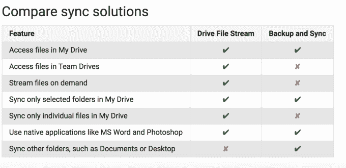

# 谷歌推出 Drive File Stream，为 G Suite 用户取代 Google Drive 桌面应用

> 原文：<https://web.archive.org/web/https://techcrunch.com/2017/09/07/google-launches-drive-file-stream-to-replace-the-google-drive-desktop-app-for-g-suite-users/>

Google today [宣布](https://web.archive.org/web/20230307142252/https://gsuiteupdates.googleblog.com/2017/09/drive-file-stream-from-google.html)为 Google Drive 用户推出新的桌面应用，名为 Drive File Stream，现在 G Suite 用户也可以使用。这款应用将取代谷歌驱动桌面应用，谷歌驱动桌面应用将于明年永久关闭——这一日期足以让企业客户有充足的时间进行转换。

该公司[早些时候已经详细说明了与这一转变相关的计划](https://web.archive.org/web/20230307142252/https://techcrunch.com/2017/07/12/google-launches-a-new-backup-sync-desktop-app-for-uploading-files-and-photos-to-the-cloud/)。

早在 7 月份，[谷歌表示](https://web.archive.org/web/20230307142252/https://techcrunch.com/2017/07/12/google-launches-a-new-backup-sync-desktop-app-for-uploading-files-and-photos-to-the-cloud/)它将把面向消费者的 Google Drive 和 Google Photos 桌面文件同步应用程序整合成一个名为“备份和同步”的新应用程序，随后它计划停止支持面向 Mac 和 PC 的旧版 Google Photos 和 Google Drive 客户端应用程序。

与此相关，它表示将推出一个名为 Drive File Stream 的企业解决方案，该方案将在晚些时候向所有 G Suite 客户推出。它还开放了一个早期采用程序的驱动文件流在那个时候。

消费者应用程序和企业版之间的一个关键区别是管理控制选项。

谷歌表示，从今天开始，公司的 it 部门将会在 G Suite 版本的管理控制台中看到驱动器文件流的设置。这将允许他们[配置](https://web.archive.org/web/20230307142252/https://support.google.com/a/answer/7496409)并为他们的域分发解决方案，包括打开同步，指定软件的安装方式，如果公司喜欢手动更新，则禁用谷歌更新，以及管理其他设置。

虽然驱动器文件流设置今天才出现，但谷歌指出，它们要到 9 月 26 日星期二解决方案全面推出时才会生效。

然而，设置的推出标志着官方对工具文件流取代:Mac 和 PC 的 Google Drive 的反对。

谷歌表示，从 2017 年 12 月 11 日开始，将不再支持旧的 Google Drive 桌面软件，并将于 2018 年 3 月 12 日完全关闭。

该公司还指出，用户可以选择安装面向消费者的工具 [Backup and Sync](https://web.archive.org/web/20230307142252/https://support.google.com/a/answer/2490101) ，作为 Drive File Stream enterprise 软件的替代或补充。

备份和同步不支持谷歌的协作团队驱动器，但它可以与驱动器文件流一起使用，以同步其他文件夹与驱动器，如文档和桌面。然而，它也与文件流共享一些功能。(让谷歌简化事情吧，在试图简化其产品时，制作两种不同的工具，它们具有重叠的功能。)

为了帮助弄清楚什么工具做什么，可以在[这里](https://web.archive.org/web/20230307142252/https://support.google.com/a/answer/7491633)找到关于两者差异的比较图表和其他细节。

发布消息的同时，Google Drive 云服务今天也出现了一些不稳定性。Drive 和 Google Classroom 今天早上都遭遇了中断——后者可能与它使用 Drive 保存附件有关。几个小时后，问题得到了解决。