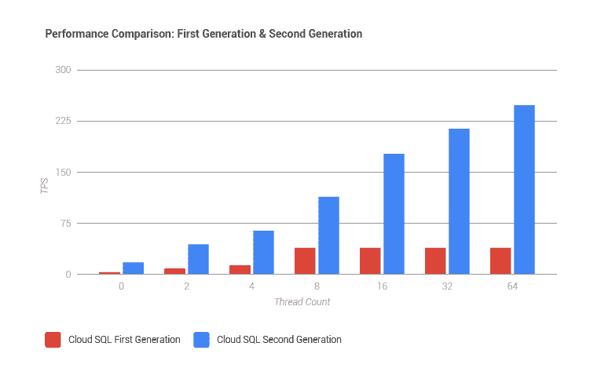
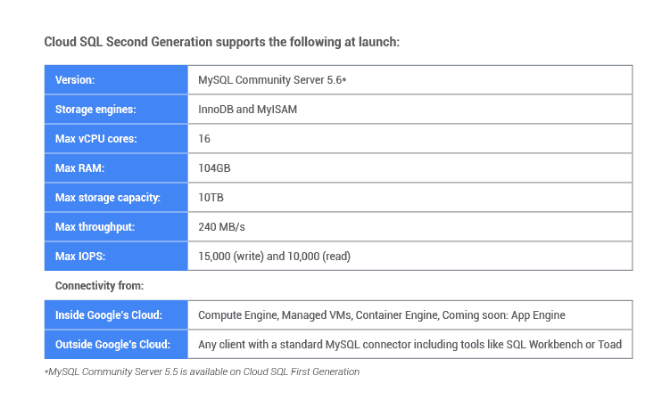

# 谷歌推出更快、更灵活的云 SQL 数据库服务 

> 原文：<https://web.archive.org/web/https://techcrunch.com/2015/12/10/google-launches-faster-more-flexible-version-of-its-cloud-sql-database-service/>

# 谷歌推出更快、更灵活的云 SQL 数据库服务

谷歌在其云平台上全面管理的 MySQL 数据库服务 Cloud SQL T1 今天进行了重大升级，推出了该服务的第二版 T3[。](https://web.archive.org/web/20230118223910/https://cloud.google.com/sql/docs/introduction#v2)

最初的云 SQL 在 2011 年发布，而[在整整两年半后才正式发布](https://web.archive.org/web/20230118223910/https://techcrunch.com/2014/02/11/googles-cloud-sql-hits-general-availability-gets-an-sla-encryption-and-support-for-larger-databases/)。谷歌表示，在今天的更新之后，Cloud SQL 的吞吐率将比早期版本快 7 倍，该服务将能够扩展到每个实例高达 10TB 的数据、15，000 IOPS 和 104GB 的内存——这些数字是第一个版本无法达到的。

通过这次更新，谷歌也改变了云 SQL 的[定价计划。该服务现在使用与 Compute Engine 相同的实例类型，正因为如此，它现在还采用了谷歌的](https://web.archive.org/web/20230118223910/https://cloud.google.com/sql/pricing#v2-pricing)[持续使用定价](https://web.archive.org/web/20230118223910/https://cloud.google.com/pricing/philosophy/)。这为您在任何给定月份运行服务器超过 25%的时间提供了折扣。

不过，在测试期间，每个人都将获得完全的持续使用折扣，不管他们实际使用他们的服务器多长时间。

以下是新版本的完整规格:

谷歌指出，这项服务的第二次迭代建立在该公司对其云平台所做的全面改进的基础上。虽然这意味着更快的速度，但也意味着更大的灵活性，因为开发人员可以扩展服务来处理更多的数据。

新版本现在还增加了高可用性故障切换和读取复制选项，以及可配置的备份周期和维护窗口。

开发者可以从几乎任何地方连接到这些数据库，包括谷歌自己的计算引擎和他们自己的工作站。然而，唯一被冷落的是 App Engine 用户，他们将不得不等待更长时间才能连接到新版本。