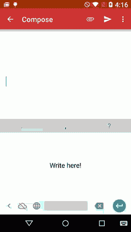

# 谷歌在 Android 上推出文本和表情符号手写输入技术 

> 原文：<https://web.archive.org/web/https://techcrunch.com/2015/04/15/google-launches-handwriting-input-for-text-and-emoji-on-android/>

# 谷歌在安卓系统上推出文字和表情符号手写输入

谷歌研究院今日[推出](https://web.archive.org/web/20221127014526/http://googleresearch.blogspot.com/2015/04/google-handwriting-input-in-82.html)其最新项目:[谷歌手写输入](https://web.archive.org/web/20221127014526/https://play.google.com/store/apps/details?id=com.google.android.apps.handwriting.ime)。除了他们的声音和最喜欢的键盘，使用 Android 4.0.3 和更高版本的 Android 用户现在也可以简单地使用良好的老式手写输入文本到任何 Android 应用程序中。

新工具可以识别 82 种语言和 20 种不同的文字。

众所周知，我自己的笔迹难以辨认，但谷歌的新工具甚至能够处理我的大部分弯曲的草书，没有太多问题。它在印刷方面几乎没有问题。

这里有一个很酷的噱头，手写输入也知道如何渲染你的手绘表情符号(是的，它立即识别出我试图调出一堆便便表情符号)。

值得指出的是，这不是谷歌第一次涉足手写识别，但这是它第一次为所有安卓系统带来对其手写工具的支持。此前，谷歌已经在谷歌翻译应用程序中推出了手写识别功能，以及移动搜索和谷歌输入工具中的[。](https://web.archive.org/web/20221127014526/https://beta.techcrunch.com/2012/07/26/search-in-cursive-google-now-lets-you-hand-write-search-queries-on-phones-and-tablets/)

这在日常使用中会有多大用处还有待观察。由于现代滑动键盘，在这一点上，Android 上的文本输入已经变得非常快速和准确。不过，正如谷歌正确指出的那样，在很多语言中，用标准键盘打字很有挑战性。谷歌特别指出，对于许多用户来说，手写输入更容易的例子有复杂文字的南亚语言和像中文这样的表意语言。谷歌已经为这些语言中的许多语言提供了特殊的手写输入，但正如谷歌研究团队所指出的，这款新应用程序结合了这些努力，并允许在设备上和基于云的字符识别。

这款新应用现在已经在 [Google Play 商店](https://web.archive.org/web/20221127014526/https://play.google.com/store/apps/details?id=com.google.android.apps.handwriting.ime)上架。