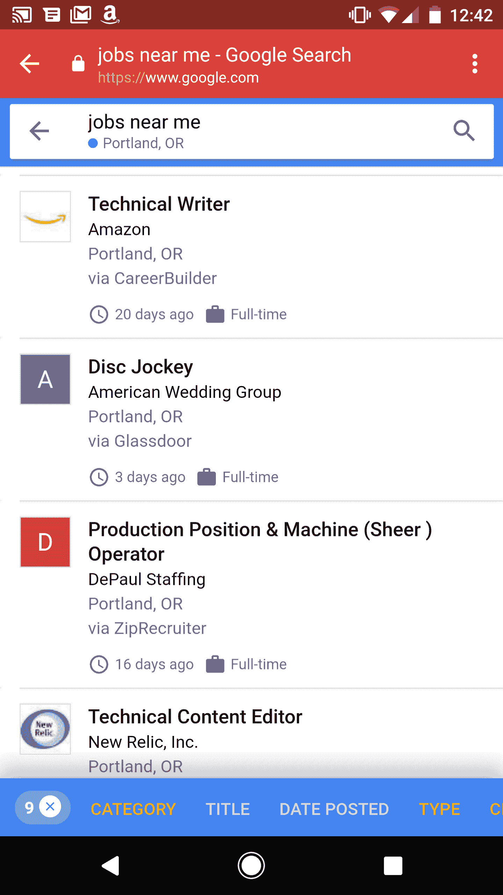

# 谷歌推出人工智能工作搜索引擎

> 原文：<https://web.archive.org/web/https://techcrunch.com/2017/06/20/google-launches-its-ai-powered-jobs-search-engine/>

找新工作越来越容易了。谷歌今天在其搜索结果页面上推出了一项新的职位搜索功能，让你可以在几乎所有主要的在线职位板上搜索职位，如 LinkedIn、Monster、WayUp、DirectEmployers、CareerBuilder 和脸书等。谷歌还将在公司主页上发布其搜索到的职位列表。

这里的想法是给求职者一个简单的方法来查看哪些工作是可用的，而不必去多个网站只找到重复的发布和许多不相关的工作。

 有了这个新功能，现在在桌面和手机上都有英文版，你只需输入类似“我附近的工作”、“写作工作”之类的查询，搜索结果页面就会显示新的工作搜索小工具，让你看到范围广泛的工作。在此基础上，您可以进一步细化您的查询，例如，只包括全职职位。当你点击查看某个职位的更多信息时，你也可以看到 Glassdoor，甚至是一家公司的评级。

您还可以按行业、地点、发布时间和雇主来筛选工作。找到有效的查询后，您还可以打开通知功能，以便在发布与您的个性化查询相匹配的新职位时，您可以立即收到提醒。

“找工作就像约会，”谷歌这个项目的产品经理尼克·扎克拉塞克告诉我。“每个人都有自己独特的偏好，只需要一个人就能胜任这份工作。”

为了创建这份全面的名单，谷歌首先必须删除雇主在所有这些招聘网站上发布的所有重复列表。然后，它的机器学习训练的算法对它们进行筛选和分类。这些工作网站通常已经使用了至少一些特定于工作的标记来帮助搜索引擎理解什么是工作发布(尽管通常情况下，当谷歌只为这种类型的查询显示 10 个蓝色链接时，这种搜索引擎优化工作现在会用长而非常详细的工作标题来扰乱新界面)。

一旦你找到工作，谷歌将引导你到工作网站，开始实际的申请过程。对于出现在多个网站上的职位，谷歌会将你链接到发布最完整的职位。一位谷歌发言人告诉我:“我们希望这将激励网站在求职者列表中分享所有相关细节。”。

至于实际的申请过程本身，谷歌不想在这里碍事，当你在它的服务上找到工作后，它不会处理任何过程。

值得注意的是，谷歌并不试图根据它已经知道的东西来筛选工作。正如 Zakrasek 打趣的那样，你喜欢去钓鱼的事实并不意味着你正在寻找一份渔船上的工作。

谷歌非常清楚，它不想与 Monster、CareerBuilder 和类似的网站直接竞争。例如，它目前还没有计划让雇主直接在它的工作搜索引擎上发布职位(尽管这肯定会有利可图)。“我们想做我们最擅长的事情:搜索，”Zakrasek 说。“我们希望生态系统中的参与者更加成功。”他补充说，除此之外的任何事情都不在谷歌的掌控之中。

当我问他与谷歌的合作将如何改变求职网站的竞争格局时，Monster.com 的首席技术官 Conal Thompson 在一份书面声明中回应了这一点。他写道:“谷歌新的求职产品符合我们的核心战略，将允许候选人在整个网络上探索工作，并完善搜索标准，以满足他们的独特需求。”“是的，与任何事情一样，现有的招聘网站将面临一些挑战和调整；最大的可能是那些目前由搜索引擎优化驱动的公司。”