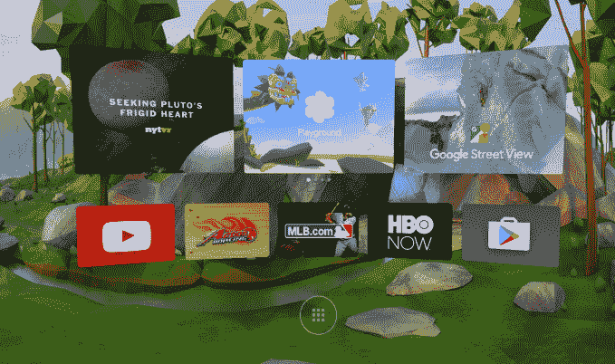

# 谷歌推出了测试版的白日梦虚拟现实开发工具

> 原文：<https://web.archive.org/web/https://techcrunch.com/2016/09/22/google-launches-its-daydream-vr-development-tools-out-of-beta/>

多亏了今天从测试版退出的新谷歌 VR SDK 的发布，谷歌的 VR 平台 Dreamweaver 现在已经准备好吸引开发者的全部注意力。该公司表示，该套件将允许开发人员为准备好做白日梦的手机和耳机构建虚拟现实体验，并且现在支持与 Unity 和虚幻游戏引擎和工具的集成。

该公司今年早些时候首次在谷歌 I/O 中披露了白日梦，同时有消息称谷歌将创建自己的白日梦虚拟现实耳机。

白日梦平台的想法是把用户最喜欢的应用程序带到虚拟现实中，这个平台被整合到安卓 7.0 (Nougat)中。许多应用程序将会在发布时在 T2 上市，包括网飞、Hulu、HBO、Imax、MLB、NBA、CNN、纽约时报和华尔街日报，还有一些游戏开发者，包括育碧和电子艺术。

正如谷歌先前所说的，白日梦将会有一个家庭启动器和一个虚拟现实内容的店面。

Daydream VR SDK 1.0 简化了常见的 VR 开发任务，因此开发者可以专注于开发他们的应用程序，谷歌在关于该版本的[公告](https://web.archive.org/web/20230227220041/https://developers.googleblog.com/2016/09/google-vr-sdk-graduates-out-of-beta.html)中表示。谷歌虚拟现实产品经理 Nathan Martz 写道，SDK 现在可以通过 [Daydream 开发者网站](https://web.archive.org/web/20230227220041/https://developers.google.com/vr/concepts/overview-daydream?utm_campaign=vr_discussion_sdk_092216&utm_source=gdev&utm_medium=blog)向所有人提供，并支持“集成的异步重投影、高保真空间化音频和使用 Daydream 控制器的交互”。

开发者网站也更新了完整的文档、示例应用和教程，以帮助那些 VR 开发和 Daydream 新手入门。

谷歌指出，与 Unity 的原生集成也是新的，它增加了对头部跟踪、深度链接和简单的 Android 清单配置等功能的支持。同时，虚幻引擎(UE4)的集成得到了改进，现在包括编辑器中的 Daydream 控制器支持，颈部模型，新的渲染优化等等。

第一批支持 Daydream 的手机和耳机要到今年秋天才会上市，但谷歌正在努力为上市做好应用准备。

也是在今天，开放了白日梦访问程序(DAP)。会员将是最初唯一能够将他们的应用程序推送到 Google Play 的人，他们将首先看到 Daydream 开发工具的更新。有兴趣的开发者可以在这里申请加入该计划[。](https://web.archive.org/web/20230227220041/https://developers.google.com/vr/daydream/daydream-access-program?utm_campaign=vr_discussion_sdk_092216&utm_source=gdev&utm_medium=blog)