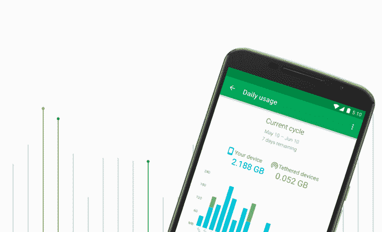
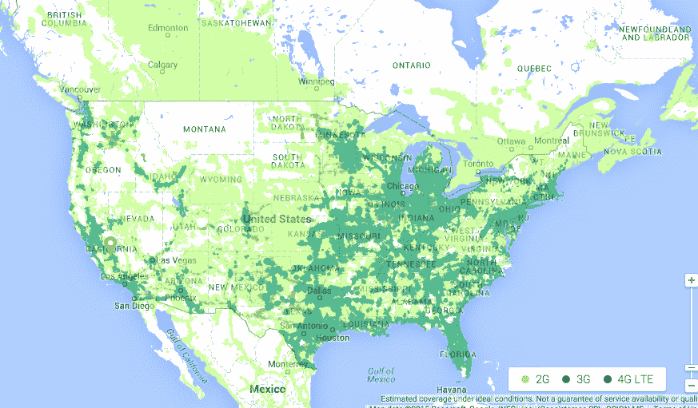

# 谷歌推出自己的无线服务 Project Fi 

> 原文：<https://web.archive.org/web/https://techcrunch.com/2015/04/22/google-launches-its-own-wireless-service-project-fi/>

# 谷歌推出自己的无线服务 Project Fi

正如数月来传言的那样，谷歌刚刚宣布了提供自己的无线蜂窝服务的计划。

**这是我们目前所知的:**

*   它叫做“菲计划”
*   起初，它只适用于 Nexus 6 用户。
*   现在只接受邀请。你可以在这里注册[一个邀请](https://web.archive.org/web/20221007021336/http://fi.google.com/)。
*   它建立在 Sprint 和 T-Mobile 的网络之上
*   没有合同
*   用户支付 20 美元无限通话/短信，然后支付 10 美元每 g 数据。因此，3GB 计划将在 20 美元的基础上增加 30 美元，总计 50 美元。
*   你只需为你使用的东西付费，但方式有点奇怪:如果你每月为 3GB 的数据付费(30 美元)，但只使用 1.5GB，月底你会得到 15 美元的回报。

*   这一切都与谷歌 Hangouts 紧密相连，除了手机，你还可以在任何支持 Hangouts 的平板电脑或笔记本电脑上拨打电话。
*   包括无线网络共享。
*   这是他们的美国覆盖地图目前的样子(蒙大拿州基本得不到爱):

[https://web.archive.org/web/20221007021336if_/https://www.youtube.com/embed/xfFHnBQ6nQg?feature=oembed](https://web.archive.org/web/20221007021336if_/https://www.youtube.com/embed/xfFHnBQ6nQg?feature=oembed)

视频