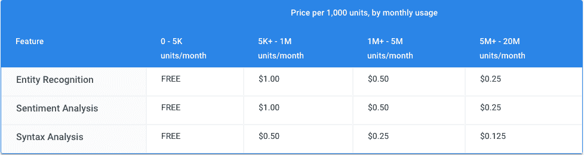

# 谷歌推出新 API 帮助你解析自然语言 

> 原文：<https://web.archive.org/web/https://techcrunch.com/2016/07/20/google-launches-new-api-to-help-you-parse-natural-language/>

# 谷歌发布新 API 帮助你解析自然语言

谷歌今天[宣布](https://web.archive.org/web/20221229194735/https://cloudplatform.googleblog.com/2016/07/the-latest-for-Cloud-customers-machine-learning-and-west-coast-expansion.html)推出其[云自然语言 API](https://web.archive.org/web/20221229194735/https://cloud.google.com/natural-language/) 的公开测试版，这是一项新服务，让开发者能够访问谷歌支持的情感分析、实体识别和语法分析。

这个新的 API 加入了谷歌其他预先训练的机器学习 API，如[云语音 API](https://web.archive.org/web/20221229194735/https://cloud.google.com/speech/) ，它现在也可以在公开测试中使用，[视觉 API](https://web.archive.org/web/20221229194735/https://cloud.google.com/vision/) 和[翻译 API](https://web.archive.org/web/20221229194735/https://cloud.google.com/translate/) 。

新的云自然语言 API 目前支持英语、西班牙语和日语文本。谷歌指出，这里的想法是提供一种“能够满足各行各业的开发者和企业的规模和性能需求”的服务

当然，为情感分析和实体识别提供 API 并不新鲜。毕竟，像 Thomson Reuters Open Calais 这样的服务已经为实体识别(即自动识别和标记文本中提到的人、组织、地点和事件的能力)提供了近十年的支持。情感分析也不是一个新概念。

另一方面，能够识别词类并创建[依赖解析树](https://web.archive.org/web/20221229194735/https://en.wikipedia.org/wiki/Parse_tree)的语法分析 API 还没有被广泛使用。看看开发人员如何在他们的应用程序中使用它们会很有趣，但很容易看出这如何用于支持聊天机器人，并帮助他们理解传入的请求。

使用自然语言 API 的价格取决于您使用三种不同服务中的哪一种，以及您计划分析多少条记录。这是谷歌的价格图表:

对于可以识别 80 多种语言的云语音 API，定价是基于你计划分析多少分钟的录音:每月的前 60 分钟是免费的，之后，你将支付每 15 秒 0.006 美元。