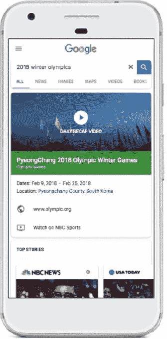
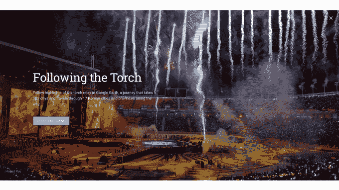

# 谷歌在搜索、视频、虚拟现实等领域推出奥运主题功能

> 原文：<https://web.archive.org/web/https://techcrunch.com/2018/02/07/google-launches-olympics-themed-features-across-search-video-vr-and-more/>

谷歌[今天宣布](https://web.archive.org/web/20230307142250/https://blog.google/products/search/six-ways-google-can-keep-you-speed-pyeongchang/)它将为谷歌搜索和其他产品增加一系列功能，以帮助用户寻找关于平昌 2018 年冬奥会的最新信息。

正如该公司经常为重大事件所做的那样，在被各种关键词和搜索词触发后，额外的信息将开始出现在谷歌搜索结果的顶部。此外，谷歌将把用户连接到直播视频、VR 视频，加上与冬季奥运会相关的谷歌地球和街景图像。

例如，如果你搜索冬季奥运会，谷歌会返回一个各种运动的小缩略图列表，你可以点击它获得更新——比如哪些运动员赢了。它还会使用您的当前位置来更新您的国家在奖牌数方面的排名，以及显示来自比赛的头条新闻，等等。

同样值得注意的是谷歌如何将 YouTube 整合到搜索结果中。

从明天(2018 年 2 月 8 日)开始，搜索结果将返回 YouTube 上来自官方奥运转播商的精选冬奥会视频集锦。[谷歌表示，这一专题将在全球 80 多个国家直播，包括一系列广播合作伙伴的参与，如 NBC 环球(美国)、BBC(英国)、NHK(日本)、法国电视台(法国)和欧洲体育(欧洲其他地区)。](https://web.archive.org/web/20230307142250/https://blog.google/products/search/six-ways-google-can-keep-you-speed-pyeongchang/)

在美国，谷歌为断线钳提供的顶级流媒体服务 YouTube TV 将直播奥运会。在印度、巴基斯坦、孟加拉国、斯里兰卡、不丹、马尔代夫和尼泊尔，冬奥会将首次在 YouTube 的奥运频道上免费直播。

YouTube 电视订户也可以获得虚拟现实报道，他们现在可以使用他们的凭据登录到 [NBC 体育虚拟现实应用](https://web.archive.org/web/20230307142250/https://play.google.com/store/apps/details?id=com.nbc.winter.olympics.android&hl=en)。该应用程序将提供超过 50 小时的 NBC 直播视频报道，包括开幕式、高山滑雪、冰球、花样滑冰、单板滑雪、冰壶等。

在欧洲， [Eurosport 虚拟现实应用](https://web.archive.org/web/20230307142250/https://play.google.com/store/apps/details?id=com.discapp.winter.olympics.android&hl=en)提供类似的虚拟现实覆盖。

谷歌也将奥运内容整合到了谷歌地球和街景中。在前一种情况下，谷歌地球旅行者教育功能中现在有一个“体育”类别，将包括五个关于冬季奥运会的故事，如[跳台滑雪](https://web.archive.org/web/20230307142250/https://earth.app.goo.gl/5qGnJ)目的地、[奥运火炬接力](https://web.archive.org/web/20230307142250/https://earth.app.goo.gl/54XFT)和[南韩旅行路线](https://web.archive.org/web/20230307142250/https://g.co/earth/seoul)。

与此同时，街景已经更新了体育场以及平昌附近城镇的新图像。

谷歌助手也将回答关于奥运会的问题——它的竞争对手 Alexa 现在也在提供这项服务。NBC 也为谷歌助手平台推出了一款以奥运为主题的小游戏[T1。](https://web.archive.org/web/20230307142250/https://assistant.google.com/services/a/uid/000000666e33da19?source=web)