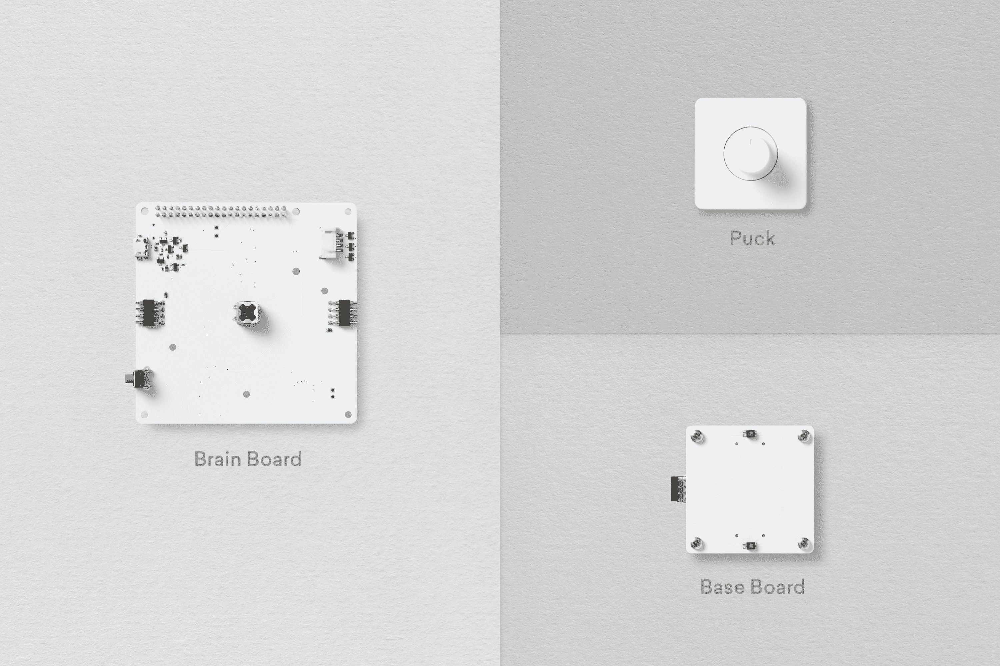
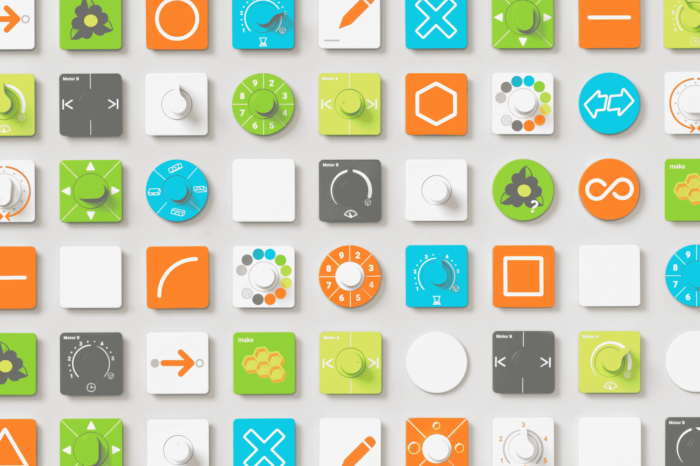
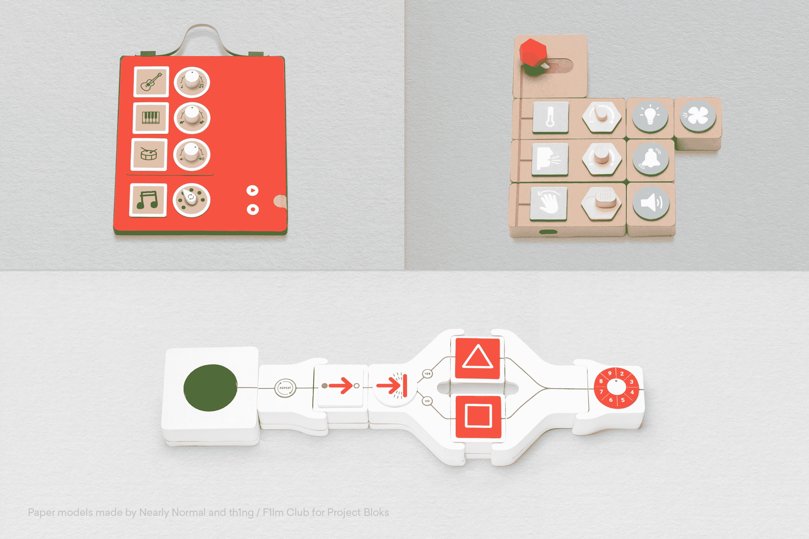
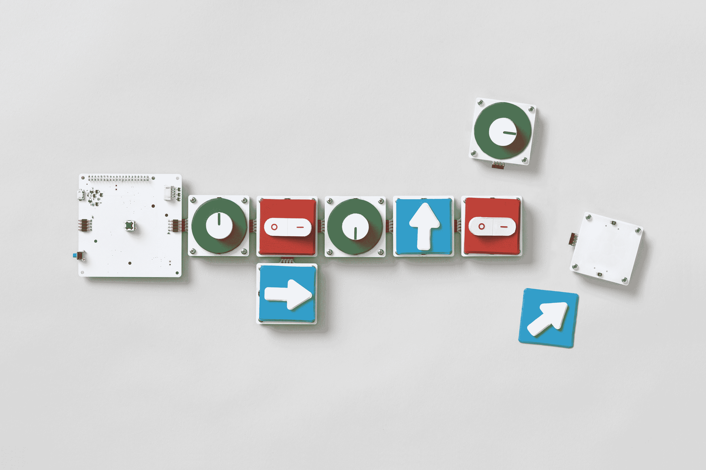

# 谷歌启动 Bloks 项目

> 原文：<https://web.archive.org/web/https://techcrunch.com/2016/06/27/google-launches-project-bloks-a-new-open-hardware-platform-for-teaching-kids-to-code/>

谷歌今天宣布了 Project Bloks(T1)，这是一个新的开放硬件平台，允许开发者、设计师和教育工作者构建物理编程体验，帮助儿童(5 岁以上)学习编码。

虽然谷歌与设计公司 [IDEO](https://web.archive.org/web/20230316043054/https://www.ideo.com/) 合作建立了一个参考工具包，但这里的想法是提供一个平台，其他人可以用来建立自己的设备。谷歌的团队提供了该平台的基础，但该团队告诉我，它目前没有计划建立自己的零售版本。“现在，谷歌没有计划进入玩具行业，”团队负责人 Jayme Goldstein 和技术负责人 Joao Wilbert 告诉我。

为了实现这个项目，为谷歌创意实验室工作的戈尔斯坦和威尔伯特与谷歌研究和教育团队 IDEO 以及斯坦福大学变革学习技术实验室主任保罗·布利克斯坦(Paulo Blikstein)一起工作。

虽然教育工作者对有形编程很感兴趣，但研究进展缓慢。Bloks 团队认为，很难对有形的编程进行实验，因为从头开始构建一个这样的平台需要大量的工程工作，因此也需要大量的资金。该团队问自己的问题是:“我们能否创建技术基础，使研究人员更容易创建切实的编程体验？”

Blikstein 在一份声明中说:“想象一下，如果我们有 10 倍多的人开发儿童学习编码和计算思维的方法，会发生什么:不仅仅是传统的方法，而是以不同的方式教授编程的工具包，如制作音乐或控制物理世界。”“这就是这个平台将实现的:让跳出框框思考变得容易，没有所有的技术障碍。”

那么这个平台实际上是什么样子的呢？Bloks 系统基本上由三部分组成。这一切的核心是所谓的“大脑板”，这是一个基于 Raspberry Pi Zero 的小型板，充当中央处理器，为系统的其余部分提供电源(其中还包括一个扬声器)。

大脑板然后与所谓的“Pucks”和“Base Board”对话，这两者共同构成了 Project Bloks 的物理编程语言。

Pucks 不包括任何有源电子元件，可以像一张带有导电墨水的纸一样简单，提供基本的编程命令，如“打开或关闭”、“向左移动”、“旋转 180 度”等指令。团队告诉我，这些冰球可以是静态的，也可以是交互式的。

设计师肯定会找到自己的方式来以物理形式呈现这些命令，但在谷歌的参考设计中，它们看起来大多像转盘、开关和按钮。

然后，基板从圆盘上读取指令，并将它们传递给主大脑板。它们基本上是将指令从程序的不同部分传送到大脑的管道。基板具有触觉电机和 LED，因此用户可以获得实时反馈。正如该团队所指出的，基板也可以用来播放大脑板上的音频。

然而，可能最重要的是，因为它允许很大的灵活性，基板也允许分支，所以代码不一定是线性的，实际上可以变得相当复杂。

利用所有这些，孩子们可以使用 Bloks 来控制一个[乐高 WeDo 2.0](https://web.archive.org/web/20230316043054/https://techcrunch.com/2016/01/04/legos-wedo-2-0-robotics-kit-teaches-science-and-engineering-to-elementary-school-students/) 机器人，或者众所周知的 [Mirobot](https://web.archive.org/web/20230316043054/http://mirobot.io/) 绘画机器人。该团队告诉我，他们还尝试将这些球与在线体验连接起来，然后将冰球和平板电脑结合在一起(默认情况下，所有组件都不必连接到互联网)。

既然 Bloks 项目已经公开，看看教育者和支持他们的行业会有什么反应将会很有趣。目前，谷歌正在寻找愿意在今年晚些时候[参与其调查研究的教育工作者、研究人员、开发者和家长。该团队今天还发布了一份](https://web.archive.org/web/20230316043054/https://projectbloks.withgoogle.com/register-interest/)[立场文件](https://web.archive.org/web/20230316043054/https://projectbloks.withgoogle.com/static/Project_Bloks_position_paper_June_2016.pdf)，更详细地解释了该项目的目标。

