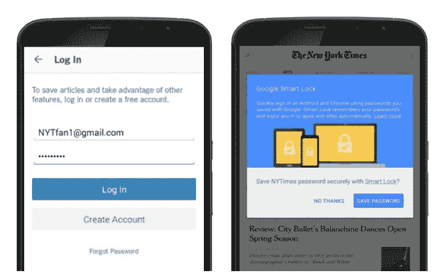
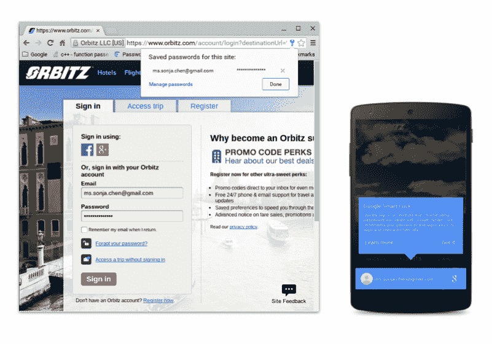

# 谷歌推出 Android 智能锁密码管理器，让登录应用更容易 

> 原文：<https://web.archive.org/web/https://techcrunch.com/2015/05/28/google-launches-smart-lock-passwords-manager-for-android-to-make-signing-into-apps-easier/>

# 谷歌推出 Android 智能锁密码管理器，让登录应用程序更容易

今天，谷歌将其所有的登录和身份解决方案整合到一个平台中，命名为“[谷歌身份平台](https://web.archive.org/web/20221221003924/https://developers.google.com/identity/)”。然而，更有趣的是，谷歌今天将推出智能锁密码管理器，这将使用户更容易登录实现这项服务的第三方 Android 应用程序。

智能密码锁本质上是一个内置在谷歌账户中的安卓应用和网络密码管理器。

在 Android 上，这项服务基本上做了 Chrome 已经在网络上做的事情，但针对应用程序。假设你想登录《纽约时报》的应用——它是这项服务的合作伙伴之一。登录后，Smart Lock 会询问您是否要将密码保存到您的帐户。然后，当你获得一个用你的谷歌账户登录的新设备时，该应用程序就会知道你的纽约时报密码，并为你预先填写你的凭据——就像你在网站上所期望的那样。

任何想要实现这一功能的开发者都可以在 Android 新的[智能锁 API](https://web.archive.org/web/20221221003924/https://developers.google.com/identity/smartlock-passwords/android/) 的帮助下实现。谷歌辩称，这将有助于应用和网站提高注册和登录率——考虑到在手机上输入密码是多么令人讨厌，这可能是真的。

除了纽约时报，谷歌还与 Eventbrite、Instacart、Orbitz、LinkedIn 和网飞合作试点这个项目。网飞似乎也计划在安卓电视上支持这一功能，毕竟在安卓电视上输入密码也很麻烦。

谷歌表示，它计划在 Android 上添加对同步密码短语的支持——让你加密你的密码，这样谷歌就无法读取它们——并且该 API 将很快支持其他平台。

