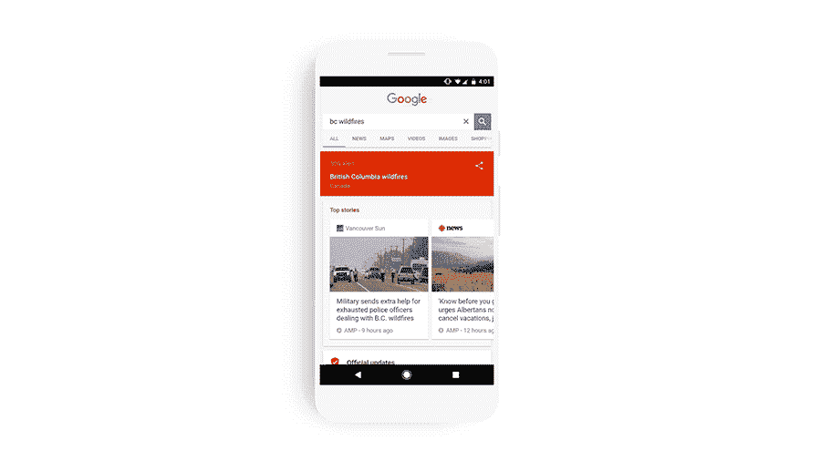
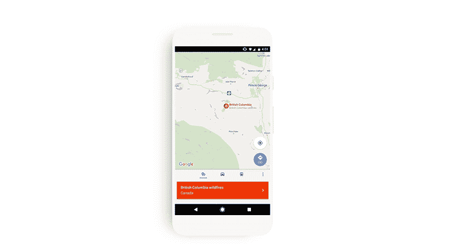

# 谷歌在搜索和地图中发布 SOS 警报，在危机中帮助用户

> 原文：<https://web.archive.org/web/https://techcrunch.com/2017/07/25/google-launches-sos-alerts-in-search-and-maps-to-help-its-users-during-a-crisis/>

# 谷歌在搜索和地图中发布 SOS 警报，以帮助用户应对危机

谷歌今天为搜索和地图推出了一项新功能，旨在当自然灾害或其他危机袭击他们的地区时，为用户提供更好的信息。现在，当用户寻找事故或受灾地区的信息时，这些新的所谓“SOS 警报”将出现在该公司搜索结果和地图的顶部。

该公司与许多机构合作，包括红十字会、联邦紧急事务管理局、菲律宾大气、地球物理和天文服务管理局和许多其他机构，以获取这些信息。

在搜索中，谷歌将显示情况概述、地图、相关新闻报道、紧急电话号码(如果有的话)、网站和其他相关信息。如果你靠近一个发生灾难的地区，谷歌也可能会向你发送通知，指引你找到所有这些信息。

在地图中，谷歌也会在相关的时候弹出这些信息。与搜索结果一样，地图会显示活动信息以及相关的电话号码和网站。此外，该地图还将显示道路封闭和交通更新的实时更新。

这项新功能将用于桌面搜索、移动网络搜索、Android 和 iOS 版谷歌应用以及移动版谷歌地图搜索。

SOS Alerts 加入了谷歌现有的应对危机的服务组合，包括 [谷歌寻人器](https://web.archive.org/web/20230305184318/https://google.org/personfinder/global/home.html)、 [谷歌危机地图](https://web.archive.org/web/20230305184318/https://www.google.org/crisismap/weather_and_events)和 [谷歌公共警报](https://web.archive.org/web/20230305184318/https://www.google.org/publicalerts)。

