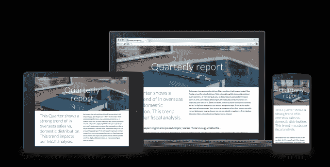

# 谷歌推出面向企业客户的人工智能助手“跳板”

> 原文：<https://web.archive.org/web/https://techcrunch.com/2016/06/14/google-launches-springboard-an-ai-powered-assistant-for-its-enterprise-customers/>

# 谷歌推出面向企业客户的人工智能助手“跳板”

谷歌为其企业客户发布了两个重要的[公告](https://web.archive.org/web/20230130234836/http://googleforwork.blogspot.com/2016/06/powering-a-more-connected-and-collaborative-enterprise.html)，其中最引人注目的是推出了一个新的数字助理 Springboard，以帮助利用谷歌服务开展业务的企业。

已经在“一小群客户”中进行测试的 Springboard 有点像面向企业员工的 Google Now。也就是说，它提供了一个单一的搜索界面，利用人工智能在用户的谷歌产品套件中显示信息，如谷歌驱动、Gmail、日历、谷歌文档等。这很重要，因为根据谷歌应用程序工程副总裁 Prabhakar Raghavan 的说法，“普通知识工作者(目前)每周花相当于一整天的时间来搜索和收集信息。”

除了搜索之外，Springboard 还在用户的整个工作日为他们提供“有用且可行的信息和建议”。

今天新闻的第二个方面是谷歌网站的新设计，这是一个像信息门户一样存放公司内部信息的产品，如季度报告或时事通讯。现在，在设计谷歌网站时，用户可以进行拖放式编辑和实时协作，这些创建功能已经成为谷歌文档和谷歌表单等其他服务的标准。

最后，在表现形式方面，谷歌网站已经进行了改进，使内容适合任何类型的屏幕，无论是智能手机、笔记本电脑还是 30 英寸显示器。

这些变化正在向早期采用者计划推广，现有的谷歌工作应用程序客户可以加入——跳板计划是这里的和谷歌网站计划是这里的——而搜索巨头已经开玩笑说，它为这两种服务“准备了更多”。