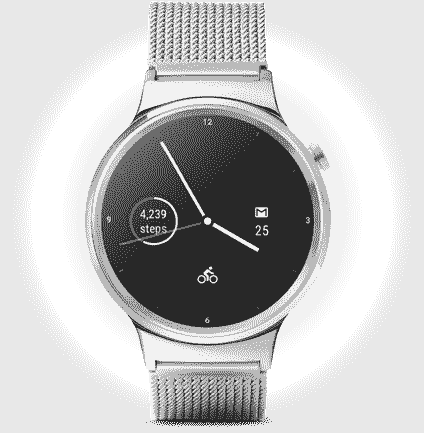

# 在 2 月份发布 TechCrunch 之前，谷歌发布了 Android Wear 2.0 的第五个也是最后一个开发预览版

> 原文：<https://web.archive.org/web/https://techcrunch.com/2017/01/24/google-launches-the-fifth-and-final-dev-preview-of-android-wear-2-0-ahead-of-february-launch/>

# 谷歌在 2 月份发布之前发布了 Android Wear 2.0 的第五个也是最后一个开发预览版

经过一段时间的延迟后, [Android Wear 2.0](https://web.archive.org/web/20221206142809/https://developer.android.com/wear/preview/index.html) 终于要发布了。今天，谷歌[在 2 月初的消费者发布会之前发布了第五个也是最后一个开发者预览版的 Wear 2.0。](https://web.archive.org/web/20221206142809/https://developer.android.com/wear/preview/index.html)

这里没有什么大的惊喜，但是随着这个版本的发布，Android Wear 2.0 最终也获得了 iOS 的全面支持，这在之前的预览版中是缺失的，但在现在还没有。“磨损”的旗舰功能之一是支持独立应用程序(以及新的复杂功能、改进的通知、键盘和手写识别)。

 这个最终预览版现在还允许将手表与苹果手机配对的 iOS 用户从 Play Store 安装这些应用程序。运行在手表上的应用程序也可以在配对的 iOS 设备上发送登录请求和打开网页。

这个版本的其他新功能包括[新风格的导航抽屉](https://web.archive.org/web/20221206142809/https://developer.android.com/wear/preview/features/ui-nav-actions.html#create-a-drawer)和对 [NFC 基于主机的卡仿真](https://web.archive.org/web/20221206142809/https://developer.android.com/guide/topics/connectivity/nfc/hce.html)的支持。

谷歌自己已经表示，它将在 2 月初推出带有两款手表的 Android Wear 2.0([可能来自 LG](https://web.archive.org/web/20221206142809/http://www.technobuffalo.com/2017/01/23/lg-watch-sport-watch-style-android-wear-2-0-image/) ) [。如果你今天想测试这个更新，你必须通过](https://web.archive.org/web/20221206142809/https://beta.techcrunch.com/2016/12/22/android-wear-2-0-debuts-on-two-partner-flagship-smartwatches-in-early-2017/)[几个步骤才能让它工作](https://web.archive.org/web/20221206142809/https://developer.android.com/wear/preview/downloads.html)(类似于旧的 Android 开发者预览版)。

谷歌从未为这些预览版提供空中更新，但如果你不想经历这些麻烦，Wear 2.0 很快就会为你的手表提供(假设它兼容，如果你有一只旧手表，这不一定是必然的)。尚不清楚更新将于何时推出。很有可能新手表会预装 Wear 2.0，但现有用户需要等待更长时间才能获得它。