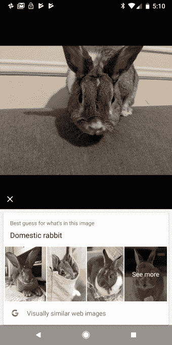

# 谷歌镜头仍有很长的路要走 

> 原文：<https://web.archive.org/web/https://techcrunch.com/2017/10/17/google-lens-on-pixel-2-still-has-a-long-way-to-go/>

谷歌眼镜在 I/O 上的亮相是开发者大会最激动人心的时刻之一，该工具有望成为一种新型的视觉浏览器，可以识别用户周围的世界，并让他们轻松访问信息和上下文网络。

我已经看了一下 Pixel 2 XL 上的镜头测试版，很明显，我们距离实现它的真正效用还有很长的路要走。这完全没问题；技术能力很少有大的飞跃，计算机视觉识别总是在不太理想的条件下挣扎。问题是，谷歌正在销售一款没有大量消费者使用的计算机视觉工具，作为其旗舰设备的一个相当重要的卖点。

Lens 有很大的潜力，但这需要时间，目前还不清楚谷歌为什么匆忙推出这款产品。Assistant 自推出以来显然并不完美，它还有很多不能做的事情，但用户能够确定它有助于哪些查询，并从那里继续前进。对于镜头来说，更难采取这种方法，因为镜头进一步隔离了它需要的理想条件，以便按预期发挥作用。

在我使用 Lens 的几天里(目前在 Google Photos 应用程序中可用，稍后将出现在相机中)，它还没有以任何方式证明自己是一个不可或缺的功能，但随着更多的微调，很明显谷歌将机器学习注入用户友好流程的努力将导致我们如何与世界数字化互动的一些非常重要的进步。

谷歌在发布会上的做法似乎真的不太像是关于发现，而是简单地吹捧 Pixel 2 可以像我们一样实现人工智能。从全局来看，这是惊人的，但是…它并不那么有用。

当镜头识别相册或书籍等物品时，该工具的操作水平与亚马逊在其原生移动应用程序中的视觉搜索类似，该应用程序已经在实时功能中实现了这一功能，谷歌不会在 Pixel 2 上推出这一功能。即使是“Now Playing”功能通常也只能识别相当明显的歌曲，这首先否定了 Shazam 等工具的明确用例——发现那些隐藏在舌尖上的珍贵歌曲。

虽然 ARKit 和 ARCore 等智能手机平台会让我们看起来好像正在接近一些真正令人敬畏的 AR 用例，但事实是，与实际收集有意义的数据相比，有效地找到一个稳定的平面来平衡数字对象或感知一个区域的几何形状是微不足道的。Lens 展示了在用户从这些功能中获得效用之前，我们还有多远的路要走。

目前，人工智能助手很大程度上是由他们遇到的问题来定义的。Siri 是它不能做的和它能做的一样多的产物。众所周知，Google Home 和 Amazon Echo 最喜欢的答案是“嗯，我不太明白”，但我们认为他们会相当愚蠢。说到镜头，这没有什么不同。事实是，谷歌将人工智能工具紧密集成到我们的生活中的回报不会立竿见影。在很长很长的一段时间里，它会让人觉得相当花哨。问题是，谷歌似乎没有做太多事情来遏制人们对他们能提供什么和不能提供什么的期望，他们很高兴让你相信，未来已经内置于其最新的旗舰手机中，尽管未来仍处于测试阶段。

有很多很好的理由选择 Pixel 2，其中大部分是相机，但镜头不应该是考虑的一部分。这是未来的赌注，未来的路还很长。