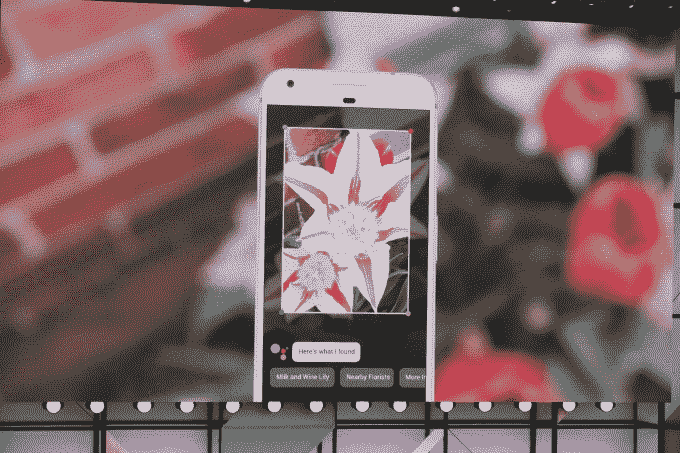
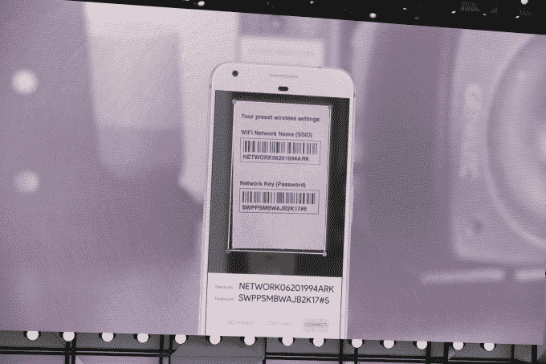

# 谷歌镜头将让智能手机摄像头理解他们看到的东西并采取行动

> 原文：<https://web.archive.org/web/https://techcrunch.com/2017/05/17/google-lens-will-let-smartphone-cameras-understand-what-they-see-and-take-action/>

在谷歌的 I/O 开发者大会上，首席执行官桑德尔·皮帅宣布了一项名为谷歌镜头的新技术。该产品的想法是利用谷歌的计算机视觉和人工智能技术，以便将智能直接引入手机摄像头。正如该公司[解释](https://web.archive.org/web/20230316161301/https://twitter.com/Google/status/864891667723300864)的那样，智能手机摄像头不仅会看到你所看到的，还会理解你所看到的，以帮助你采取行动。

在一次演示中，谷歌展示了如何将你的相机对准某样东西，镜头会告诉你这是什么——就像，它可以识别你准备拍摄的花。

在另一个例子中，皮查伊展示了 Lens 如何完成一项普通任务——通过拍摄路由器上的标签照片，将你连接到家中的 Wi-Fi 网络。

在这种情况下，Google Lens 可以识别出它正在查看一个网络的名称和密码，然后向你提供一个选项，点击一个按钮，自动连接。

第三个例子是一家企业店面的照片 Google Lens 可以调出照片上出现的卡片中的名称、评级和其他企业列表信息。

这项技术基本上将相机从一个捕捉你周围世界的被动工具变成了一个允许你与相机取景器中的东西互动的工具。

后来，在一次 Google Home 演示中，该公司展示了 Lens 将如何集成到 Google Assistant 中。通过助手应用程序中的一个新按钮，用户将能够启动 Lens 并将照片插入到与助手的对话中，助手可以处理照片包含的数据。

为了展示这是如何工作的，谷歌的斯科特·霍夫曼(Scott Huffman)将他的相机举到一个音乐会的帐篷上，观看一场石狐表演，谷歌助手调出门票销售信息。“把这个加到我的日历上，”他说——它做到了。

将 Lens 集成到 Assistant 中也有助于翻译。

霍夫曼展示了这一点，他把相机举到一个日文标志前，点击镜头图标，说“这是什么意思？”谷歌助手然后翻译文本。

此外，皮查伊展示了谷歌的算法如何更普遍地清理和增强照片——比如当你通过链条围栏给孩子的棒球比赛拍照时，谷歌可以自动从照片中移除围栏。或者，如果你在弱光条件下拍摄照片，谷歌可以自动增强照片，使其不那么像素化和模糊。

该公司没有宣布谷歌镜头何时上市，只是说它将“很快”上市。