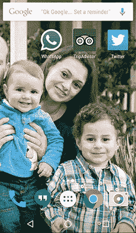

# 谷歌可以让你在 LinkedIn 和 WhatsApp  等安卓应用中翻译 90 种语言的文本

> 原文：<https://web.archive.org/web/http://techcrunch.com/2015/10/06/google-lets-you-translate-text-in-90-languages-within-android-apps-like-linkedin-and-whatsapp/>

# 谷歌让你可以在 LinkedIn 和 WhatsApp 等安卓应用中翻译 90 种语言的文本

随着安卓最新操作系统棉花糖的发布，大量新功能将在未来几周内推出。

现在推出的更有趣的新功能之一是在 WhatsApp 等流行的 Android 应用程序中翻译文本的能力。举例来说，如果你只会说英语，而你的朋友只会说俄语，那就太大了。

谷歌[今天](https://web.archive.org/web/20230331022322/http://googletranslate.blogspot.com/2015/10/translate-text-within-apps-thanks-to.html)宣布了新功能，开发者可以通过文本选择行为将谷歌翻译嵌入到他们的应用中。

这很不错，我相信我们会看到更多的应用程序推出这一功能。谷歌首先提到了猫途鹰、WhatsApp 和 LinkedIn。旅行、聊天和商务。有道理。