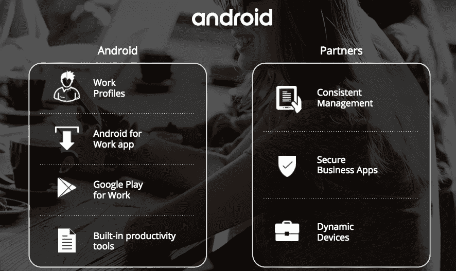

# 谷歌推出 Android For Work TechCrunch，进军移动企业市场

> 原文：<https://web.archive.org/web/https://techcrunch.com/2015/02/25/google-makes-a-push-for-the-mobile-enterprise-market-with-android-for-work/>

今天在三藩市的一个小型新闻发布会上，谷歌正式推出了用于工作的安卓系统，这一系列技术使得公司更容易采用安卓系统，并允许他们的用户带着他们自己的设备去工作。

该公司在去年夏天的 I/O 开发者大会上首次公布了这项技术的[预览](https://web.archive.org/web/20221208233650/http://www.android.com/it/preview/)，但正如谷歌该项目的产品管理总监 Rajen Sheth 在今天的活动中指出的那样，这是一个极其复杂的项目，因为它不仅涉及建立一个新平台，还涉及与合作伙伴合作验证其方法。

到目前为止，Android for Work 还是一个只有受邀者才能参与的小项目，谷歌与 Pearson、Woolworths 和 Guardian Life 等多家合作伙伴合作，完善其方法。

Android for Work 背后的总体想法是，允许员工在同一台设备上使用他们的个人应用程序和商业应用程序，同时确保商业数据和个人数据的安全，不被员工掌握。

正如 Sheth 所描述的那样，该项目的总体愿景是实现“一个每个员工都能够使用移动设备完成工作的未来——今天的个人和企业智能手机，以及明天的先进商务设备。”

Sheth 解释说:“我们想让 it 部门更容易对 Android 和更多人的移动性说好。”为了实现这一愿景，Android for Work 启用了 IT 策略和共享限制等功能，将业务数据与设备上的其他数据隔离开来。

Android for Work 的四大基石是:

1.  支持隔离个人和工作数据的工作配置文件，并赋予 IT 管理这些数据的能力，
2.  一个用于旧设备的 Android 工作应用程序，
3.  Google Play for Work 商店，以及
4.  一套面向企业用户的新生产力工具。

![[PRESS] Android for Work - Press Deck - 25 Feb 15 - Google Slides-2](img/dcc35da1c0f99ec701e5c4a6189fd8e1.png)

使用早期的企业移动管理服务一点也不好玩。例如，员工经常不得不使用单独的启动器来访问他们的业务应用程序。不过，正如 Sheth 指出的，这种方法并不比携带两个独立的设备好多少。

对于旧设备，谷歌仍然通过其 Android for Work 应用程序提供类似的体验，该应用程序现已推出。虽然 Lollipop 默认支持 Android for Work(或者至少允许供应商启用它)，但旧设备(从冰激凌三明治版本开始)上的用户将不得不依赖这个应用程序。

对于员工来说，使用 Android 工作意味着可以轻松地在设备上的应用程序之间无缝切换，而 it 管理员仍然可以完全控制设备上的策略、配置文件和业务数据。作为他们工作档案一部分的应用程序将通过应用程序图标顶部的一个小图标来突出显示，但除此之外，该应用程序将按照预期工作，并将集成到整体 Android 用户体验中。

管理员还可以获得 Google Play 的托管版本，允许他们管理和分发预先批准的应用程序。

![[PRESS] Android for Work - Press Deck - 25 Feb 15 - Google Slides](img/cb857b405710970dd3a684a610bc8f3d.png)

由于谷歌自己的许多移动生产力应用程序都是专门针对谷歌工作应用程序的，该公司还在为 Android 工作用户开发一套更通用的电子邮件、日历、联系人和任务管理应用程序。这些新应用还包括一些文档、电子表格和演示文稿的基本编辑功能，并与微软 Exchange 和 IBM Notes 等企业平台完全集成。

在今天的新闻发布会上，谷歌强调，它在这个项目上与大量合作伙伴合作。其中包括拥有大型企业业务的硬件和软件公司，包括 SAP、Citrix、思科、摩托罗拉、惠普、三星、联想、HTC、Concur、Adobe 和 Salesforce。

例如，这些合作伙伴将能够利用谷歌为这项服务提供的 API，将他们的企业移动管理服务与 Android for Work 集成在一起。与此同时，软件供应商将能够创建其业务应用的单一 Android 版本，并将其安全地部署到任何 Android 设备，而无需额外的安全包装。

![[PRESS] Android for Work - Press Deck - 25 Feb 15 - Google Slides-1](img/7626b1f3d10cf142b585b5b723d8209f.png)

总的来说，这里的想法显然是为了让相对开放的 Android 生态系统对企业更具吸引力。正如谷歌所言，移动企业市场在很大程度上仍未开发，有数十亿设备可供员工带去工作，但实际上无法用来完成工作(例如，我知道我们在 TechCrunch 对此有些问题，因为 AOL 的企业安全协议)。

许多企业已经在使用 iOS ，它已经提供企业管理服务有一段时间了，但是考虑到 Android 更广阔的生态系统，还有许多公司仍在观望。