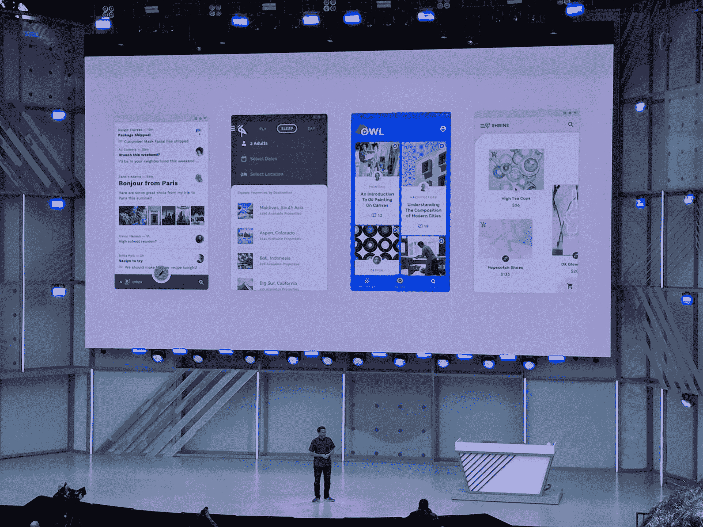
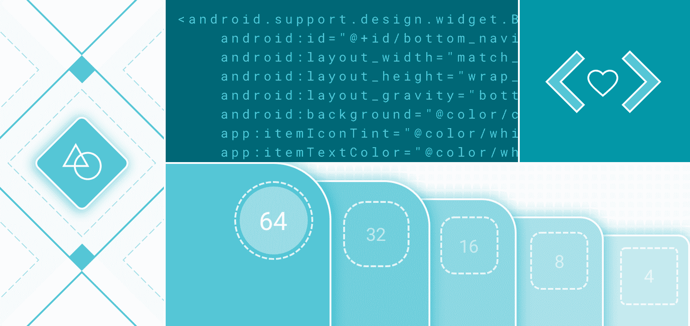
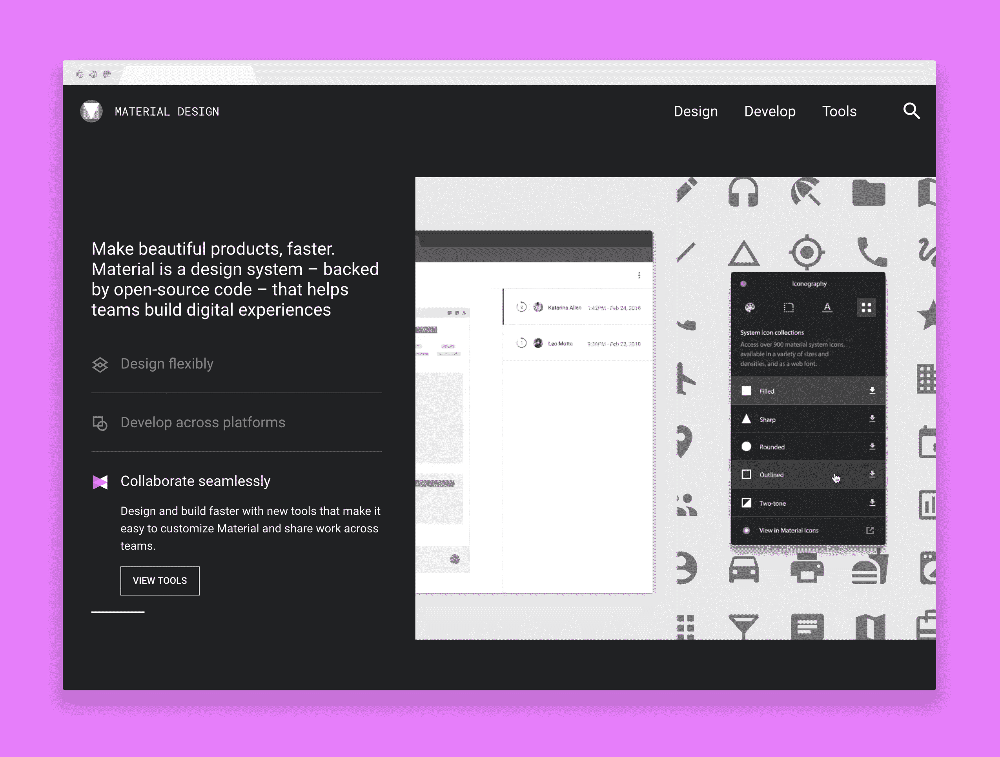

# 谷歌使其材料设计系统更容易定制

> 原文：<https://web.archive.org/web/https://techcrunch.com/2018/05/08/google-makes-its-material-design-system-easier-to-customize/>

自 2014 年以来，材料设计一直是谷歌应用程序的设计语言。现在，该公司通过提供一系列围绕主题化和设计迭代的新工具，以及开发人员可以在自己的应用程序中实现的新开源组件，大大扩展了围绕其设计系统的服务。除此之外，谷歌正在制作 [Material Gallery](https://web.archive.org/web/20230405000634/http://material.io/gallery) ，这是它用来帮助其设计师合作设计的相同工具，可供所有人使用。

所有这些新功能现在都可以在重新设计的 [Material.io](https://web.archive.org/web/20230405000634/http://material.io/) 网站上获得。

谷歌没有对整体设计语言做出任何重大改变，但它让开发者更容易将材料设计应用到自己的项目中，今天的两个发布会专门关注这一点。第一个是[材质主题化](https://web.archive.org/web/20230405000634/http://material.io/design/material-theming/)，也就是说，可以做一些小的改变，比如颜色或者排版，然后应用到整个主题中。

“主题化让任何人都可以一致地、系统地表达他们在产品中的独特风格，”该团队解释道。“例如，当你做出一些关于颜色和排版的决定时，很容易将方向应用到整个环境中。”

谷歌本身已经在使用这个系统，并指出任何公司现在都可以很容易地调整这个系统，使其符合自己的品牌方针。

调整这些设计仍然需要一些工作，所以第二个新功能——[材质主题编辑器](https://web.archive.org/web/20230405000634/http://material.io/theme-editor) —现在让尝试新设计变得容易得多。它为开发人员提供了一个控制面板，可以轻松地将全局样式更改应用到颜色、排版和形状。

这里一个漂亮的特性是编辑器允许你根据你的设计导出你自己的材质主题。虽然你可以应用的调整仍然有点有限，但谷歌表示，随着时间的推移，它将增加更多的定制选项。

目前，编辑器只能与流行的 [Sketch](https://web.archive.org/web/20230405000634/https://www.sketchapp.com/) design 应用一起工作，你可以通过下载 Sketch 的材质插件来开始使用它。

除了主题化组件的工作，谷歌今天还为材料设计推出了新的[图标集](https://web.archive.org/web/20230405000634/https://material.io/icons/)。这些新的图标主题也可以定制，有基线、圆形、双色、锐利和轮廓变化。

虽然主题化是此次发布的亮点，但谷歌今天也宣布，它正在研究一些新的材料组件，也就是说，一套预建的设计组件。这些将于今年晚些时候推出。

不过，这次发布的真正亮点可能是[材料展厅](https://web.archive.org/web/20230405000634/http://material.io/gallery)。“现在任何人都可以使用材料库来审查和评论设计迭代，”材料设计团队今天写道。这是谷歌设计师多年来用于内部设计合作的同一工具，现在它已经退出测试并向所有人开放。“Gallery 工具允许设计师对他们同事的设计发表评论，无论是图像还是视频帧。

谷歌指出，画廊不仅仅是为了分享和合作设计，它还允许开发者将这些设计带到主题编辑器中。

