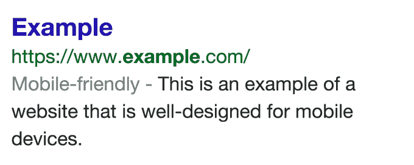

# 谷歌将“移动友好”作为全球排名信号，提升搜索结果中的索引应用 

> 原文：<https://web.archive.org/web/https://techcrunch.com/2015/02/26/google-makes-mobile-friendliness-a-ranking-signal-worldwide-boosts-indexed-apps-in-search-results/>

谷歌今天宣布了两项显著的变化，将影响用户在移动设备上访问谷歌搜索的搜索结果排名。它现在将把一个网站的移动友好性作为其排名信号之一，来自索引移动应用程序的信息也将开始影响智能手机上安装了该应用程序的登录用户的排名。

“随着越来越多的人使用移动设备访问互联网，我们的算法必须适应这些使用模式，”谷歌在其[公告](https://web.archive.org/web/20230129223959/http://googlewebmastercentral.blogspot.com/2015/02/finding-more-mobile-friendly-search.html)中解释道。

在此之前，谷歌已经做出了一系列努力来改善其针对移动用户的搜索结果。[例如，在 2013 年](https://web.archive.org/web/20230129223959/http://googlewebmastercentral.blogspot.com/2013/06/changes-in-rankings-of-smartphone_11.html?utm_source=wmc-blog&utm_medium=referral&utm_campaign=mobile-friendly)，它推出了排名变化，这将影响对智能手机用户配置错误的网站，包括那些令人沮丧的情况，即一个特定的 URL 会将所有智能手机用户重定向到网站的移动主页，而不是他们的首选目的地。这在新闻网站中尤其常见，因为用户经常会点击一个链接来阅读某个故事，最终会登陆网站的主网页，而这个故事却无处可寻。

[去年夏天](https://web.archive.org/web/20230129223959/http://googlewebmastercentral.blogspot.com/2014/07/promoting-modern-websites-for-modern.html?utm_source=wmc-blog&utm_medium=referral&utm_campaign=mobile-friendly)，与此同时，谷歌开始标记那些由于使用的技术而无法在移动设备上显示的网站——比如那些用 Adobe Flash 构建的网站，这意味着它们无法在 iOS 设备或 Android 4.1 及更高版本上显示。

去年 11 月，谷歌开始在移动设备上访问的搜索结果中添加一个“手机友好”的标签，以表明它们可以在智能手机的小屏幕上很好地显示，这是在今年早些时候[首次测试“警告标签”之后](https://web.archive.org/web/20230129223959/https://techcrunch.com/2014/06/05/google-will-now-warn-you-when-a-sites-mobile-version-is-broken-and-dumb/)。它当时指出，它也在测试使用手机友好的标准作为排名信号。

今天，谷歌表示，从 4 月 21 日开始，它将把手机友好性作为一种排名信号扩大到全球所有语言——谷歌指出，这将对搜索结果产生“重大影响”。

在一篇详细介绍这些变化的博客文章中，该公司向网站所有者提供了大量可以帮助他们为这一转变做好准备的资源，包括其[移动友好网站指南](https://web.archive.org/web/20230129223959/https://developers.google.com/webmasters/mobile-sites/get-started/?utm_source=wmc-blog&utm_medium=referral&utm_campaign=mobile-friendly)，其[移动友好测试工具](https://web.archive.org/web/20230129223959/https://www.google.com/webmasters/tools/mobile-friendly/?utm_source=wmc-blog&utm_medium=referral&utm_campaign=mobile-friendly)，以及其[移动可用性报告](https://web.archive.org/web/20230129223959/https://www.google.com/webmasters/tools/mobile-usability?utm_source=wmc-blog&utm_medium=referral&utm_campaign=mobile-friendly)。

此外，该公司还表示，将开始利用深度链接技术的优势，开始在搜索结果中更靠前的位置显示移动应用程序的信息。

对于那些不熟悉的人来说，深层链接指向移动应用程序本身中的特定页面。这意味着在他们的应用程序中实现这些链接的开发者允许谷歌以类似于它今天对网站所做的方式来索引他们的应用程序。

这种“应用程序索引”技术于 2013 年秋季在谷歌关于其 KitKat 移动操作系统的新闻发布会上首次推出。当时，该公司解释了 Android 开发者如何通过允许谷歌搜索直接指向他们的应用页面来吸引和重新吸引应用用户。

在宣布这一消息后的几个月里，该公司一直在稳步[扩大利用深度链接的移动应用](https://web.archive.org/web/20230129223959/http://insidesearch.blogspot.com/2014/04/accessing-your-app-content-in-google.html)的数量，去年春天增加了几十个，后来[将深度链接技术与 AdWords](https://web.archive.org/web/20230129223959/https://techcrunch.com/2014/04/22/google-to-offer-mobile-app-install-ads-in-search-and-youtube-expands-app-deep-linking-to-adwords/) 集成，以便允许开发者创建广告，引导用户启动他们的应用。

在相关新闻中，谷歌今天早上还宣布，它将开始允许应用程序开发者在其 Google Play 商店的结果中运行搜索广告。