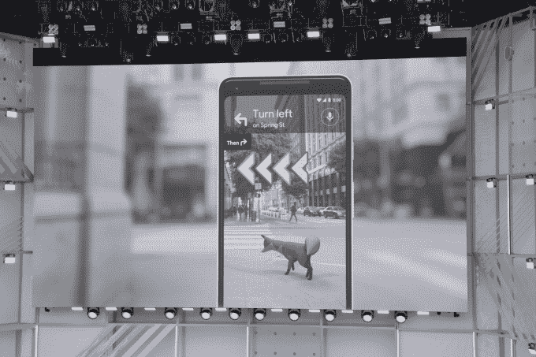
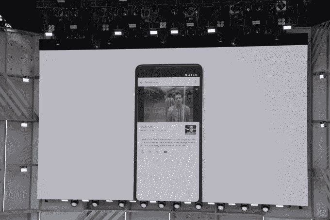
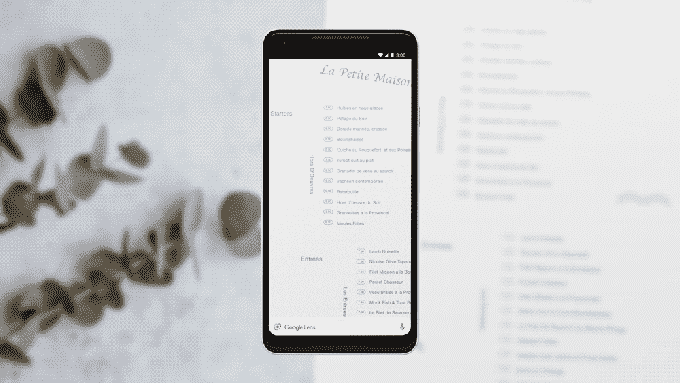
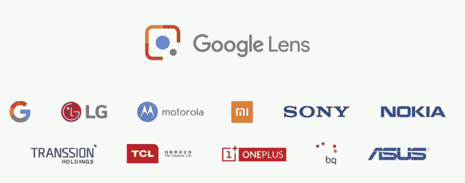

# 谷歌通过更新谷歌镜头，整合街景，让相机更智能

> 原文：<https://web.archive.org/web/https://techcrunch.com/2018/05/08/google-makes-the-camera-smarter-with-a-google-lens-update-integration-with-street-view/>

谷歌今天展示了结合智能手机摄像头观察周围世界的能力和人工智能技术力量的新方法。该公司在其谷歌 I/O 开发者大会上展示了一种巧妙的方法，即结合使用相机和谷歌地图来帮助人们更好地在他们的城市中导航，以及为其先前宣布的谷歌镜头技术(在去年的 I/O 上推出)提供的一些新功能。

地图集成结合了摄像头、计算机视觉技术和带有街景的谷歌地图。

这个想法类似于人们在没有技术的情况下如何导航——他们寻找显著的地标，而不仅仅是街道标志。

随着相机/地图的结合，谷歌现在也在这样做。实际上，就像你跳进了街景里。

在界面中，谷歌地图用户界面位于屏幕底部，而摄像头则向你展示你面前的东西。甚至还有一个动画向导(一只狐狸),你可以跟着它找到你的路。

该功能是在谷歌智能相机技术谷歌镜头的几个新功能之前推出的。

谷歌镜头已经可以做一些事情，比如识别建筑物，甚至狗的品种，只需将你的相机对准有问题的物体(或宠物)。

随着谷歌镜头的升级，它也将能够识别文本。例如，如果你正在看菜单，你可以将相机对准菜单文本，以便了解一道菜由什么组成——在 stage 的例子中，谷歌演示了识别《料理鼠王》组成部分的镜头。

然而，该功能也可以用于交通标志、海报或名片上的文本。

Google Lens 不仅仅是阅读单词，它还理解单词背后的含义和上下文，这就是该功能如此强大的原因。

例如，您还可以将现实世界中的文本(如食谱、礼品卡代码或 Wi-Fi 密码)复制并粘贴到您的手机上。这项功能在去年的 Google I/O 上演示过，但现在才推出。

另一个名为 Style Match 的新功能类似于之前在 Google Images 中推出的类似 Pinterest 的时尚搜索选项。

有了这个，你可以将相机对准一件衣服——比如衬衫或裤子——甚至是手袋之类的配饰 Lens 就会找到与这件衣服风格相匹配的物品。它通过在数百万个项目中进行搜索来做到这一点，但也通过理解不同的纹理、形状、角度和照明条件来做到这一点。

最后，Google Lens 增加了实时功能，这意味着当你将相机对准你周围的世界时，它会主动寻找要识别的东西，然后尝试将其焦点锁定在某个给定的项目上，并呈现有关它的信息。

谷歌的[说，这是因为机器学习的进步，使用设备上的智能和云 TPU，使 Lens 能够在一瞬间识别数十亿个单词、短语、地点和事物。](https://web.archive.org/web/20230224031618/https://www.blog.google/products/google-vr/google-lens-real-time-answers-questions-about-world-around-you/)

它还可以在商店门面、街道标志或音乐会海报上显示搜索结果。

谷歌增强现实、虚拟现实和基于视觉的产品(Lens)负责人 Aparna Chennapragada 在活动中指出:“摄像头不仅仅是回答问题，而是将答案放在问题所在的地方。”

谷歌镜头之前在照片和谷歌助手中可用，但现在将集成到各种顶级制造商设备的相机应用中，包括 LGE，摩托罗拉，小米，索尼移动，HMD/诺基亚，Transsion，TCL，一加，BQ 和华硕，以及谷歌 Pixel 设备。(见下文)。

谷歌镜头的更新功能将在未来几周内推出。

