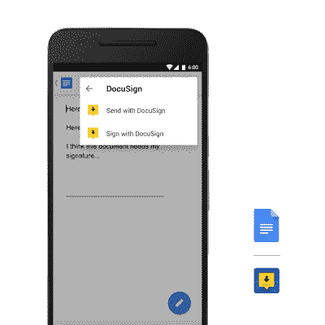

# 谷歌通过新的 Android 插件让在移动设备上工作变得更容易

> 原文：<https://web.archive.org/web/https://techcrunch.com/2016/07/28/google-makes-working-on-mobile-easier-with-new-android-add-ons-for-docs-sheets/>

# 谷歌通过新的 Android 插件让在移动设备上工作变得更加容易

谷歌今天宣布了用于文档和表格的 Android 插件，这是在移动设备上使用谷歌 office 程序时使用第三方服务的一种更简单的方式。这些 Android 插件可在 Google Play 商店的可下载应用程序中获得，也可在 Google Docs 和 Sheets 中获得。谷歌解释说，这些附加软件可以让你做一些事情，比如将 CRM 数据放入你的电子表格，或者为电子签名准备一份合同，等等。

该公司与几家合作伙伴合作开发了首批附加产品。例如， [DocuSign](https://web.archive.org/web/20221209235521/http://docusign.com/blog/docusign-now-enabled-with-google-docs-android-add-ons) 的插件将允许您在文档或表单中触发或完成签名过程。 [ProsperWorks](https://web.archive.org/web/20221209235521/http://www.prosperworks.com/blog/prosperworks-customer-report-builder-add-on-for-google-sheets-goes-mobile/) 让你将 CRM 数据拉进谷歌表单。 [AppSheet](https://web.archive.org/web/20221209235521/http://blog.appsheet.com/create-an-app-with-google-sheets-in-your-phone) 可让您从表格中的数据创建移动应用程序，而 [Scanbot](https://web.archive.org/web/20221209235521/https://medium.com/@Scanbot/scanbot-integration-with-google-docs-475f59af14e5#.ncbdiexut) 可让您使用 OCR 扫描商业文档，然后将其内容作为可编辑文本插入文档。

其他合作伙伴包括 [PandaDoc](https://web.archive.org/web/20221209235521/https://www.pandadoc.com/blog/PandaDoc-available-for-Google-Docs-App?utm_source=goog&utm_medium=blog&utm_campaign=promo&utm_content=goog-blog-promo) 、 [ZohoCRM](https://web.archive.org/web/20221209235521/http://www.zoho.com/crm/blog/introducing-zoho-crm-mobile-add-on-for-google-sheets.html) 、[教师助手](https://web.archive.org/web/20221209235521/https://play.google.com/store/apps/details?id=com.apps.ips.TeacherAideDemo2)、 [EasyBib](https://web.archive.org/web/20221209235521/http://www.easybib.com/guides/introducing-our-easybib-google-docs-mobile-integration/) 。

此外，谷歌还为其教育平台 [Classroom](https://web.archive.org/web/20221209235521/https://play.google.com/store/apps/details?id=com.google.android.apps.classroom) 推出了自己的插件。

该公司指出，除了 Google Play 之外，还可以从移动设备上的 Google Docs 和 Sheets 的附加菜单中访问这些附加功能。

多年来，附加软件在办公桌面软件程序和在线生产力软件[中很常见。](https://web.archive.org/web/20221209235521/http://www.theverge.com/2015/4/27/8505275/microsoft-outlook-apps-add-ins-desktop-365)谷歌还有[一个广泛的第三方插件列表，可以与谷歌应用程序和谷歌驱动协同工作。然而，谷歌这种移动优先的方法解决了越来越多的人不仅通过网络，还通过手机使用办公程序的事实。](https://web.archive.org/web/20221209235521/https://apps.google.com/marketplace/u/0/)

Google Play 提供了一系列受支持的 Android 插件。随着更多合作伙伴的加入，它可能会随着时间的推移而扩大。